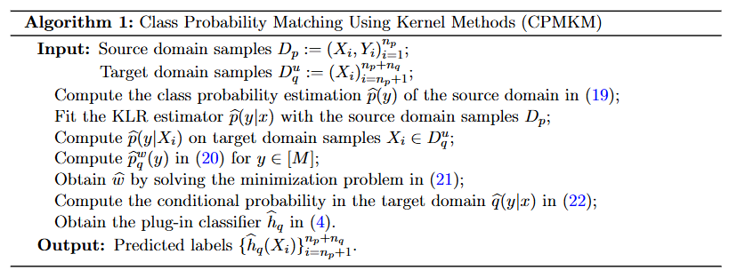
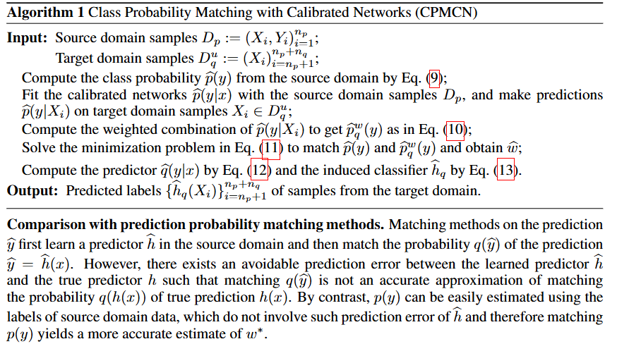
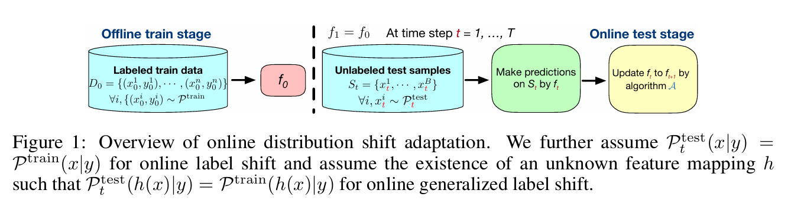
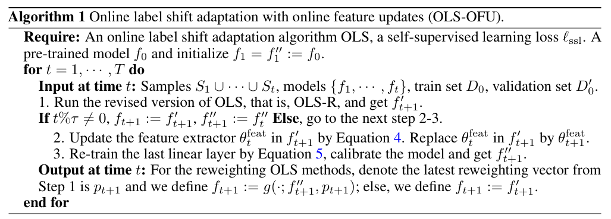

# Test-Time Prior Adaptation

A curated list of recent methods for handling label distribution shift at test time. Click “📄”, “🔍” or “💻” to access the PDF, Google Scholar entry, or code repo.

---

### `TTADC` [Ma et al., **MICCAI 2022**]  
**Test-time adaptation with calibration of medical image classification nets for label distribution shift**  
[📄 PDF](https://arxiv.org/abs/2207.00769) · [🔍 G-Scholar](https://scholar.google.com/scholar?cluster=7982883573733677737&hl=en) · [💻 CODE](https://github.com/med-air/TTADC)

📌 Abstract · Contributions · Datasets & Methods

#### 🧠 Abstract
Class distribution plays an important role in learning deep classifiers. When the proportion of each class in the test set differs from the training set, the performance of classification nets usually degrades. Such a label distribution shift problem is common in medical diagnosis since the prevalence of disease varies over location and time.

In this paper, we propose the first method to tackle label shift for medical image classification, which effectively adapts the model learned from a single training label distribution to arbitrary unknown test label distribution. Our approach innovates **distribution calibration** to learn multiple representative classifiers, which are capable of handling different one-dominating-class distributions. When given a test image, the diverse classifiers are dynamically aggregated via the **consistency-driven test-time adaptation**, to deal with the unknown test label distribution.

We validate our method on two important medical image classification tasks including **liver fibrosis staging** and **COVID-19 severity prediction**. Our experiments clearly show the decreased model performance under label shift. With our method, model performance significantly improves on all the test datasets with different label shifts for both medical image diagnosis tasks.

🔗 **Code**: https://github.com/med-air/TTADC

#### 🎯 Contributions
- First work to effectively tackle label distribution shift in medical image classification.
- Extend balanced softmax loss to simulate multiple one-dominating-class distributions with ordinal encoding.
- Dynamically combine representative classifiers at test time via consistency regularization.

#### 📂 Datasets
- **Liver fibrosis staging**: In-house abdominal CT from three centers (823, 99, 50 cases), 5-stage fibrosis labels (F0–F4).
- **COVID-19 severity prediction**: Public chest CT (iCTCF), 969 train / 370 test cases, 6 severity levels (S0–S5).

#### 🖼️ Method Overview

  

---

### `SADE` [Zhang et al., **NeurIPS 2022**]  
**Self-supervised aggregation of diverse experts for test-agnostic long-tailed recognition**  
[📄 PDF](https://openreview.net/forum?id=m7CmxlpHTiu) · [🔍 G-Scholar](https://scholar.google.com/scholar?cluster=16295847624184830192&hl=en) · [💻 CODE](https://github.com/vanint/sade-agnosticlt)

📌 Abstract · Contributions · Method Overview

#### 🧠 Abstract
Existing long-tailed recognition methods assume uniform test class distribution. In practice, test distributions may be long-tailed or inversely long-tailed. We study **test-agnostic long-tailed recognition**, where training is long-tailed but test distribution is unknown. We propose **Self-supervised Aggregation of Diverse Experts**:
1. **Skill-diverse expert learning**: train multiple experts on the same long-tailed dataset for different distributions.
2. **Test-time expert aggregation**: self-supervised weighting of experts to handle unknown test distributions.

Theoretically grounded and empirically effective on vanilla and test-agnostic benchmarks.

#### 🖼️ Method Overview

  

---

### `TTLSA` [Sun et al., **NeurIPS 2023**]  
**Beyond invariance: Test-time label-shift adaptation for distributions with “spurious” correlations**  
[📄 PDF](https://arxiv.org/abs/2211.15646) · [🔍 G-Scholar](https://scholar.google.com/scholar?cluster=8297779371205142813&hl=en) · [💻 CODE](https://github.com/nalzok/test-time-label-shift)

📌 Abstract · Contributions · Datasets & Methods

#### 🧠 Abstract
We consider label-shift where joint prior p(y,z) (class label y and nuisance z) changes, but p(x|y,z) stays invariant. We apply EM to unlabeled target samples to adapt a discriminative model ps(y,z|x) without fitting p(x|y,z).

Evaluated on image/text datasets and CheXpert chest X-rays, showing improved robustness over invariance-based and ERM baselines.

🔗 **Code**: https://github.com/nalzok/test-time-label-shift

#### 🎯 Contributions
- Formulate **expanded label shift assumption** over meta-label (y,z).
- Adapt existing label-shift methods via small unlabeled target samples.
- No generative modeling of p(x|y,z) required.

#### 📂 Datasets
- **CheXpert**: 224,316 X-rays, 14 diseases + (age, sex, race) attributes, binarized labels.

#### 🖼️ Method Overview

  

---

### `FedCal` [Xu & Huang, **CIKM 2023**]  
**A joint training-calibration framework for test-time personalization with label shift in federated learning**  
[📄 PDF](https://dl.acm.org/doi/abs/10.1145/3583780.3615173) · 🔍 G-Scholar·· (pending) · 💻 CODE·· (pending)

📌 Abstract · Contributions · Method Overview

#### 🧠 Abstract
Address label shift adaptation more naturally by matching class-probability functions (CPM) instead of feature-probability matching (FPM). Introduce CPMKM: kernel logistic regression within CPM. Theoretical convergence guarantees and superior empirical performance on real datasets.

#### 🎯 Contributions
1. **CPM**: match q(y)/p(y) directly in label space.  
2. **CPMKM**: incorporate KLR into CPM with optimal rates.  
3. Empirical validation: outperforms FPM/ML baselines.

#### 🖼️ Method Overview

---

### `...` [Park et al., **ICCV 2023**]  
**Label shift adapter for test-time adaptation under covariate and label shifts**  
[📄 PDF](https://arxiv.org/abs/2308.08810) · [🔍 G-Scholar](https://scholar.google.com/scholar?cluster=6476921383522013928&hl=en)

📌 Abstract · Contributions · Method Overview

#### 🧠 Abstract
We propose a **label shift adapter** for TTA methods to handle simultaneous covariate and label shifts. Estimate target label distribution and adapt model parameters accordingly, with low computational overhead. Shows substantial gains on six benchmarks.

#### 🎯 Contributions
- Novel adapter producing parameters conditional on label distribution.  
- Plug-and-play integration with any TTA algorithm.  
- Extensive benchmarks demonstrating improved robustness.

#### 🖼️ Method Overview

    
  

---

### `DROPS` [Wei et al., **ICLR 2023**]  
**Distributionally robust post-hoc classifiers under prior shifts**  
[📄 PDF](https://arxiv.org/abs/2309.08825) · [🔍 G-Scholar](https://scholar.google.com/scholar?cluster=10995720941474911018&hl=en) · [💻 CODE](https://github.com/weijiaheng/Drops)

📌 Abstract · Contributions · Method Overview

#### 🧠 Abstract
Lightweight post-hoc scaling adjustments on a pre-trained model to minimize a distributionally robust loss under controlled shifts. Provable guarantees and strong empirical performance.

🔗 **Code**: https://github.com/weijiaheng/Drops

---

### `LSC` [Wei et al., **ICML 2024**]  
**Learning label shift correction for test-agnostic long-tailed recognition**  
[📄 PDF](https://openreview.net/forum?id=J3xYTh6xtL) · [🔍 G-Scholar](https://scholar.google.com/scholar?cluster=13080086498775196290&hl=en) · [💻 CODE](https://github.com/Stomach-ache/label-shift-correction)

📌 Abstract · Contributions · Method Overview

#### 🧠 Abstract
Introduce **label shift correction (LSC)** under a generalized black-box shift framework. Theoretically reduce generalization error by estimating test label distribution and adjusting pre-trained model outputs. Consistent SOTA improvements and compatibility with existing long-tail methods.

#### 🎯 Contributions
1. Simple LSC for test-agnostic long-tail learning.  
2. Theoretical foundations for error reduction.  
3. Empirical validation on three benchmarks.  
4. Compatibility with other long-tail methods.

---

### `Wav-O/R` [Qian et al., **ICML 2024**]  
**Efficient non-stationary online learning by wavelets with applications to online distribution shift adaptation**  
[📄 PDF](https://openreview.net/forum?id=KNedb3bQ4h) · [🔍 G-Scholar··]() · 💻 CODE··()

📌 Abstract · Contributions · Method Overview

#### 🧠 Abstract
Achieve optimal dynamic regret in non-stationary online learning using a **single-layer wavelet restart** rather than ensemble. Apply to online label shift adaptation with superior computation/storage efficiency and strong empirical gains.

#### 🖼️ Method Overview

    
  

---

### `CPMCN` [Wen et al., **ICLR 2024**]  
**Class probability matching with calibrated networks for label shift adaption**  
[📄 PDF](https://openreview.net/forum?id=mliQ2huFrZ) · 🔍 G-Scholar··() · 💻 CODE··()

📌 Abstract · Contributions · Method Overview

#### 🧠 Abstract
Develop **CPM** framework matching label probabilities directly, and **CPMCN** algorithm with calibrated nets. Theoretically guaranteed, computationally efficient, and empirically superior to matching- and EM-based methods.

#### 🎯 Contributions
- Novel CPM for label shift matching.  
- CPMCN algorithm with low complexity.  
- Theoretical generalization bound.  
- Empirical gains over SOTA.

#### 🖼️ Method Overview

---

### `OLS-OFU` [Wu et al., **arXiv 2024**]  
**Online feature updates improve online (generalized) label shift adaptation**  
[📄 PDF](https://arxiv.org/abs/2402.03545) · [🔍 G-Scholar](https://scholar.google.com/scholar?cluster=13826390929957704274&hl=en)

📌 Abstract · Method Overview

#### 🧠 Abstract
Address online label shift with missing labels by updating feature extractor via self-supervision. **OLS-OFU** refines representations at test time, maintaining similar regret bounds and achieving substantial improvements over baselines.

#### 🖼️ Method Overview

    
  

