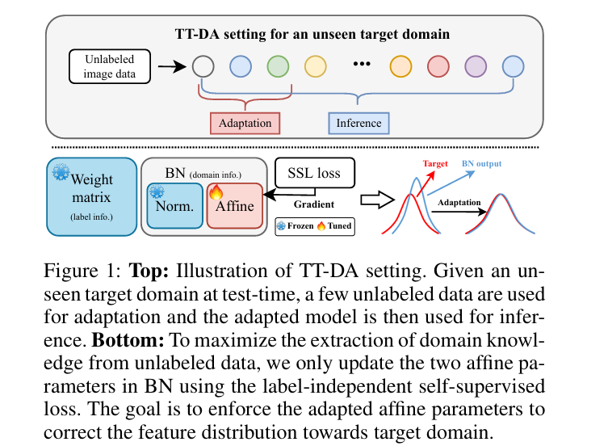
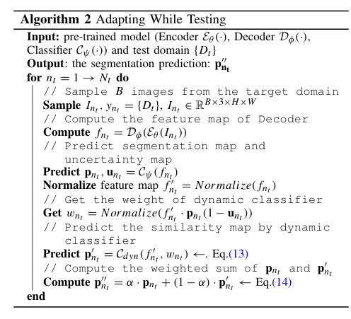

# Test-Time Batch Adaptation

**Test-Time Batch Adaptation (TTBA)** refers to a category of techniques aimed at addressing distribution shifts that occur across batches of data during model deployment. Unlike single-sample adaptation methods, TTBA leverages the statistical information within batches of test samples to dynamically adjust model parameters or input representations at test time. This approach improves model robustness and prediction accuracy when faced with batch-wise domain changes, making it especially effective in real-world scenarios where data distributions vary continuously between batches.

This collection features representative papers from recent years in this field, covering diverse applications such as computer vision, speech recognition, and industrial inspection, showcasing the latest advancements in enhancing model generalization and real-time adaptability through TTBA.

---

## Classification

- `Meta-DMoE` [Zhong et al., **NeurIPS 2022**]  
**Meta-DMoE: Adapting to domain shift by meta-distillation from mixture-of-experts**  
[📄 PDF](https://openreview.net/forum?id=_ekGcr07Dsp) · [🔍 G-Scholar](https://scholar.google.com/scholar?cluster=18362067030660551332&hl=en) · [💻 CODE](https://github.com/n3il666/Meta-DMoE)  

📌 Abstract · Contributions · Datasets & Methods

#### 🧠 Abstract
In this paper, we tackle the problem of domain shift. Most existing methods perform training on multiple source domains using a single model, and the same trained model is used on all unseen target domains. Such solutions are sub-optimal as each target domain exhibits its own specialty, which is not adapted. Furthermore, expecting single-model training to learn extensive knowledge from multiple source domains is counterintuitive. The model is more biased toward learning only domain-invariant features and may result in negative knowledge transfer. In this work, we propose a novel framework for unsupervised test-time adaptation, which is formulated as a knowledge distillation process to address domain shift. Specifically, we incorporate Mixture-of-Experts (MoE) as teachers, where each expert is separately trained on different source domains to maximize their specialty. Given a test-time target domain, a small set of unlabeled data is sampled to query the knowledge from MoE. As the source domains are correlated to the target domains, a transformer-based aggregator then combines the domain knowledge by examining the interconnection among them. The output is treated as a supervision signal to adapt a student prediction network toward the target domain. We further employ meta-learning to enforce the aggregator to distill positive knowledge and the student network to achieve fast adaptation. Extensive experiments demonstrate that the proposed method outperforms the state-of-the-art and validates the effectiveness of each proposed component. Our code is available at https://github.com/n3il666/Meta-DMoE

#### 🎯 Contributions
- We propose a novel unsupervised test-time adaptation framework that is tailored for multiple sources domain settings. Our framework employs the concept of MoE to allow each expert model to explore each source domain thoroughly. We formulate the adaptation process as knowledge distillation via aggregating the positive knowledge retrieved from MoE.  
- The alignment between training and evaluation objectives via meta-learning improves the adaptation, hence the test-time generalization.  
- We conduct extensive experiments to show the superiority of the proposed method among the state-of-the-arts and validate the effectiveness of each component of Meta-DMoE.  
- We validate that our method is more flexible in real-world settings where computational power and data privacy are the concerns.
- 
#### 🖼️ Method Overview

  
   
  

---

- `ShiftMatch` [Wang and Aitchison, **ICLR 2023**]  
**Robustness to corruption in pre-trained Bayesian neural networks**  
[📄 PDF](https://openreview.net/forum?id=kUI41mY8bHl) · [🔍 G-Scholar](https://scholar.google.com/scholar?cluster=12854599053728566431&hl=en)  

📌 Abstract · Contributions · Datasets & Methods

#### 🧠 Abstract
We develop ShiftMatch, a new training-data-dependent likelihood for robustness to corruption in Bayesian neural networks (BNNs). ShiftMatch is inspired by the training-data-dependent “EmpCov” priors from Izmailov et al. (2021a), and efficiently matches test-time spatial correlations to those at training time. Critically, ShiftMatch is designed to leave the neural network’s training time likelihood unchanged, allowing it to use publicly available samples from pre-trained BNNs. Using pre-trained HMC samples, ShiftMatch gives strong performance improvements on CIFAR-10-C, outperforms EmpCov priors (though ShiftMatch uses extra information from a minibatch of corrupted test points), and is perhaps the first Bayesian method capable of convincingly outperforming plain deep ensembles.

#### 🖼️ Method Overview

  

---

- `DN` [Zhou et al., **NeurIPS 2023**]  
**Test-time distribution normalization for contrastively learned vision-language models**  
[📄 PDF](https://arxiv.org/abs/2302.11084) · [🔍 G-Scholar](https://scholar.google.com/scholar?cluster=687525890133562566&hl=en) · [💻 CODE](https://github.com/fengyuli-dev/distribution-normalization)  

📌 Abstract · Contributions · Datasets & Methods

📌 Abstract · Contributions

#### 🧠 Abstract
Advances in the field of vision-language contrastive learning have made it possible for many downstream applications to be carried out efficiently and accurately by simply taking the dot product between image and text representations. One of the most representative approaches proposed recently known as CLIP [50] has garnered widespread adoption due to its effectiveness. CLIP is trained with an InfoNCE loss that takes into account both positive and negative samples to help learn a much more robust representation space. This paper reveals that the common downstream practice of taking a dot product is only a zeroth-order approximation of the optimization goal, resulting in a loss of information during test-time. Intuitively, since the model has been optimized based on the InfoNCE loss, test-time procedures should also be in alignment. The question lies in how one can retrieve any semblance of negative samples information during inference in a computationally efficient way. To this end, we propose Distribution Normalization (DN), where we approximate the mean representation of a batch of test samples and use such a mean to represent what would be analogous to negative samples in the InfoNCE loss. DN requires no retraining or fine-tuning and can be effortlessly applied during inference. Extensive experiments on a wide variety of downstream tasks exhibit a clear advantage of DN over the dot product on top of other existing test-time augmentation methods. Our code is available at https://github.com/fengyuli2002/distribution-normalization.

#### 🎯 Contributions
(1) We present an insightful analysis of why the dot product as a similarity measure is only a zeroth-order approximation.  
(2) We propose DN to overcome this shortcoming by utilizing an approximation of the test-time distribution, and also provide guidance on how DN can be conveniently implemented in practice.  
(3) We provide extensive supporting empirical evidence and ablation studies that demonstrate the fidelity of DN for practical use.

#### 🖼️ Method Overview

  

---

- `ATP` [Bao et al., **NeurIPS 2023**]  
**Adaptive test-time personalization for federated learning**  
[📄 PDF](https://arxiv.org/abs/2310.18816) · [🔍 G-Scholar](https://scholar.google.com/scholar?cluster=2404637854022569306&hl=en) · [💻 CODE--](https://github.com/baowenxuan/ATP)  

📌 Abstract · Contributions · Datasets & Methods

#### 🧠 Abstract
Personalized federated learning algorithms have shown promising results in adapting models to various distribution shifts. However, most of these methods require labeled data on testing clients for personalization, which is usually unavailable in real-world scenarios. In this paper, we introduce a novel setting called test-time personalized federated learning (TTPFL), where clients locally adapt a global model in an unsupervised way without relying on any labeled data during test-time. While traditional test-time adaptation (TTA) can be used in this scenario, most of them inherently assume training data come from a single domain, while they come from multiple clients (source domains) with different distributions. Overlooking these domain interrelationships can result in suboptimal generalization. Moreover, most TTA algorithms are designed for a specific kind of distribution shift and lack the flexibility to handle multiple kinds of distribution shifts in FL. In this paper, we find that this lack of flexibility partially results from their pre-defining which modules to adapt in the model. To tackle this challenge, we propose a novel algorithm called ATP to adaptively learns the adaptation rates for each module in the model from distribution shifts among source domains. Theoretical analysis proves the strong generalization of ATP. Extensive experiments demonstrate its superiority in handling various distribution shifts including label shift, image corruptions, and domain shift, outperforming existing TTA methods across multiple datasets and model architectures. Our code is available at https://github.com/baowenxuan/ATP.

#### 🎯 Contributions
• We consider TTPFL, a new learning setting in FL, addressing the challenge of generalizing to new unlabeled clients under complex distribution shifts. (Section 3)  
• We introduce ATP, which adaptively learns the adaptation rate for each module, enabling it to handle different types of distribution shifts. (Section 4)  
• We provide theoretical analysis confirming ATP’s robust generalization. (Section 5)  
• We empirically evaluate ATP over various distribution shifts scenarios, using a wide range of datasets and models. (Section 6)

#### 🖼️ Method Overview

  

  

  

---

- `DomainAdaptor` [Zhang et al., **ICCV 2023**]  
**DomainAdaptor: A novel approach to test-time adaptation**  
[📄 PDF](https://arxiv.org/abs/2308.10297) · [🔍 G-Scholar](https://scholar.google.com/scholar?cluster=9175808446688030557&hl=en) · [💻 CODE](https://github.com/koncle/DomainAdaptor)  

📌 Abstract · Contributions · Datasets & Methods

#### 🧠 Abstract
To deal with the domain shift between training and test samples, current methods have primarily focused on learning generalizable features during training and ignore the specificity of unseen samples that are also critical during the test. In this paper, we investigate a more challenging task that aims to adapt a trained CNN model to unseen domains during the test. To maximumly mine the information in the test data, we propose a unified method called DomainAdaptor for the test-time adaptation, which consists of an AdaMixBN module and a Generalized Entropy Minimization (GEM) loss. Specifically, AdaMixBN addresses the domain shift by adaptively fusing training and test statistics in the normalization layer via a dynamic mixture coefficient and a statistic transformation operation. To further enhance the adaptation ability of AdaMixBN, we design a GEM loss that extends the Entropy Minimization loss to better exploit the information in the test data. Extensive experiments show that DomainAdaptor consistently outperforms the state-of-the-art methods on four benchmarks. Furthermore, our method brings more remarkable improvement against existing methods on the few-data unseen domain. The code is available at https://github.com/koncle/DomainAdaptor

#### 🎯 Contributions
• We propose AdaMixBN to adaptively mix the training and test stats. in the transformed normalization layer, which can trade off the training and test information.  
• To better exploit unlabeled test samples, we propose the Generalized Entropy Minimization loss to effectively optimize the parameters of AdaMixBN.  
• Our proposed method exhibits significant improvement over existing approaches on four benchmark datasets for domain generalization.

#### 🖼️ Method Overview

  

  

  

---

- `ClusT3` [Hakim et al., **ICCV 2023**]  
**ClusT3: Information invariant test-time training**  
[📄 PDF](https://openaccess.thecvf.com/content/ICCV2023/html/Hakim_ClusT3_Information_Invariant_Test-Time_Training_ICCV_2023_paper.html) · [🔍 G-Scholar](https://scholar.google.com/scholar?cluster=3413390947246646353&hl=en) · [💻 CODE--](https://github.com/dosowiechi/ClusT3)  

📌 Abstract · Contributions · Datasets & Methods

#### 🧠 Abstract
Deep Learning models have shown remarkable performance in a broad range of vision tasks. However, they are often vulnerable to domain shifts at test-time. Test-time training (TTT) methods have been developed in an attempt to mitigate these vulnerabilities, where a secondary task is solved at training time, simultaneously with the main task, to be later used as an self-supervised proxy task at test-time. In this work, we propose a novel unsupervised TTT technique based on the maximization of Mutual Information between multi-scale feature maps and a discrete latent representation, which can be integrated to the standard training as an auxiliary clustering task. Experimental results demonstrate competitive classification performance on different popular test-time adaptation benchmarks. The code can be found at: https://github.com/dosowiechi/ClusT3.git

#### 🎯 Contributions
• We propose a novel Test-Time Training approach based on maximizing the MI between feature maps and discrete representations learned in training. At test time, adaptation is achieved based on the principle that information between the features and their discrete representation should remain constant across domains.  
• ClusT3 is evaluated across a series of challenging TTA scenarios, with different types of domain shifts, obtaining competitive performance compared to previous methods.  
• To the best of our knowledge, this is the first Unsupervised Test-Time Training approach using a joint training based on the MI and linear projectors. Our approach is lightweight and more general than its previous self-supervised counterparts.

#### 🖼️ Method Overview

  

  

---

- `TTTFlow` [Osowiechi et al., **WACV 2023**]  
**TTTFlow: Unsupervised test-time training with normalizing flow**  
[📄 PDF](https://openaccess.thecvf.com/content/WACV2023/html/Osowiechi_TTTFlow_Unsupervised_Test-Time_Training_With_Normalizing_Flow_WACV_2023_paper.html) · [🔍 G-Scholar](https://scholar.google.com/scholar?cluster=15158703704163101963&hl=en) · [💻 CODE](https://github.com/GustavoVargasHakim/TTTFlow)  

📌 Abstract · Contributions · Datasets & Methods

#### 🧠 Abstract
A major problem of deep neural networks for image classification is their vulnerability to domain changes at test-time. Recent methods have proposed to address this problem with test-time training (TTT), where a two-branch model is trained to learn a main classification task and also a self-supervised task used to perform test-time adaptation. However, these techniques require defining a proxy task specific to the target application. To tackle this limitation, we propose TTTFlow: a Y-shaped architecture using an unsupervised head based on Normalizing Flows to learn the normal distribution of latent features and detect domain shifts in test examples. At inference, keeping the unsupervised head fixed, we adapt the model to domain-shifted examples by maximizing the log likelihood of the Normalizing Flow. Our results show that our method can significantly improve the accuracy with respect to previous works.

#### 🎯 Contributions
• We introduce an unsupervised method under the test-time training paradigm of TTA. Our approach is designed to directly measure the domain shift between target and source images, without the need of an extra task.  
• To the best of our knowledge, this is the first work that employs Normalizing Flows to measure domain shift in Test-Time Adaptation. While they have been recently investigated for domain alignment, their application in tasks related to Domain Adaptation remains unexplored.

#### 🖼️ Method Overview

  

---

- `TTN` [Vianna et al., **NeurIPS Workshops 2023**]  
**Channel selection for test-time adaptation under distribution shift**  
[📄 PDF](https://openreview.net/forum?id=BTOBu7y2ZD) · [🔍 G-Scholar](https://scholar.google.com/scholar?cluster=17640355908283074980&hl=en)  

📌 Abstract · Contributions · Datasets & Methods

#### 🧠 Abstract
To ensure robustness and generalization to real-world scenarios, test-time adaptation has been recently studied as an approach to adjust models to a new data distribution during inference. Test-time batch normalization is a simple and popular method that achieved compelling performance on domain shift benchmarks by recalculating batch normalization statistics on test batches. However, in many practical applications this technique is vulnerable to label distribution shifts. We propose to tackle this challenge by only selectively adapting channels in a deep network, minimizing drastic adaptation that is sensitive to label shifts. We find that adapted models significantly improve the performance compared to the baseline models and counteract unknown label shifts.

#### 🎯 Contributions
• In this work, we investigate the effect of label distribution shift on TTN and observe that it can lead to catastrophic failures.  
• We analyze the effects of adapting different layers in TTN, which motivates our method.  
• We propose a method to correct for label distribution shift by selectively adapting certain channels of the batch normalization layers.  
• Our method is applied to classification tasks on two well-known natural image benchmarks (CIFAR-10 and ImageNet-1K), demonstrating effectiveness for imbalanced adaptation on target domains with different distributions.

#### 🖼️ Method Overview

  

---

- `NC-TTT` [Osowiechi et al., **CVPR 2024**]  
**NC-TTT: A noise contrastive approach for test-time training**  
[📄 PDF](https://arxiv.org/abs/2404.08392) · [🔍 G-Scholar](https://scholar.google.com/scholar?cluster=6659898368415712529&hl=en) · [💻 CODE](https://github.com/GustavoVargasHakim/NCTTT)  

📌 Abstract · Contributions · Datasets & Methods

#### 🧠 Abstract
Despite their exceptional performance in vision tasks, deep learning models often struggle when faced with domain shifts during testing. Test-Time Training (TTT) methods have recently gained popularity due to their ability to enhance the robustness of models through the addition of an auxiliary objective that is jointly optimized with the main task. Being strictly unsupervised, this auxiliary objective is used at test time to adapt the model without any access to labels. In this work, we propose **Noise-Contrastive Test-Time Training (NC-TTT)**, a novel unsupervised TTT technique based on the discrimination of noisy feature maps. By learning to classify noisy views of projected feature maps, and then adapting the model accordingly on new domains, classification performance can be recovered by a significant margin. Experiments on several popular test-time adaptation benchmarks demonstrate the advantages of our method compared to recent approaches.  
Code: [https://github.com/GustavoVargasHakim/NCTTT.git](https://github.com/GustavoVargasHakim/NCTTT.git)

#### 🎯 Contributions
• We present an innovative Test-Time Training approach inspired by the paradigm of **Noise-Contrastive Estimation (NCE)**. While NCE was originally developed for generative models and later used for unsupervised representation learning, our work is the first to apply it effectively to test-time training.  
• We motivate our method with a principled and efficient **density estimation framework**, which guides the selection of key hyperparameters.  
• Through extensive experiments, we evaluate **NC-TTT** across a range of challenging TTA scenarios involving diverse domain shifts. Our method consistently outperforms recent alternatives in this space.

#### 🖼️ Method Overview

  

---

- `MABN` [Wu et al., **AAAI 2024**]  
**Test-time domain adaptation by learning domain-aware batch normalization**  
[📄 PDF](https://arxiv.org/abs/2312.10165) · [🔍 G-Scholar](https://scholar.google.com/scholar?cluster=4488734352967116426&hl=en) · [💻 CODE](https://github.com/ynanwu/MABN)  

📌 Abstract · Contributions · Datasets & Methods

#### 🧠 Abstract
Test-time domain adaptation aims to adapt the model trained on source domains to unseen target domains using a few unlabeled images. Emerging research has shown that the label and domain information is separately embedded in the weight matrix and batch normalization (BN) layer. Previous works normally update the whole network naively without explicitly decoupling the knowledge between label and domain. As a result, it leads to knowledge interference and defective distribution adaptation. In this work, we propose to reduce such learning interference and elevate the domain knowledge learning by only manipulating the BN layer. However, the normalization step in BN is intrinsically unstable when the statistics are re-estimated from a few samples. We find that ambiguities can be greatly reduced when only updating the two affine parameters in BN while keeping the source domain statistics. To further enhance the domain knowledge extraction from unlabeled data, we construct an auxiliary branch with label-independent self-supervised learning (SSL) to provide supervision. Moreover, we propose a bi-level optimization based on meta-learning to enforce the alignment of two learning objectives of auxiliary and main branches. The goal is to use the auxiliary branch to adapt the domain and benefit main task for subsequent inference. Our method keeps the same computational cost at inference as the auxiliary branch can be thoroughly discarded after adaptation. Extensive experiments show that our method outperforms the prior works on five WILDS real-world domain shift datasets. Our method can also be integrated with methods with label-dependent optimization to further push the performance boundary. Our code is available at https://github.com/ynanwu/MABN

#### 🎯 Contributions
• We propose a simple yet effective unsupervised adaptive method that is tailored for TT-DA. We adapt only the affine parameters via a self-supervised loss to each target domain to elevate the domain knowledge learning. • We employ a bi-level optimization to align the learning objective with the evaluation protocol to yield affine parameters that are capable of adapting domain knowledge.  
• We conduct extensive experiments to show that our method is more effective in learning the domain knowledge. Thus, our domain-adapted model can be seamlessly integrated with the entropy-based TTA method (e.g. TNET (Wang et al. 2021)) where the optimization is more toward label knowledge.  
• We surpass ARM and Meta-DMoE by 9.7% and 4.3% of Macro F1 on WILDS-iWildCam. We achieve superior performance on five real-world domain shift benchmarks in WILDS with both classification and regression tasks

#### 🖼️ Method Overview

  

  

  

---

- `...` [Haslum et al., **WACV 2024**]  
**Bridging generalization gaps in high content imaging through online self-supervised domain adaptation**  
[📄 PDF](https://arxiv.org/abs/2311.12623) · [🔍 G-Scholar](https://scholar.google.com/scholar?cluster=5616759635685757071&hl=en)  

📌 Abstract · Contributions · Datasets & Methods

#### 🧠 Abstract
High Content Imaging (HCI) plays a vital role in modern drug discovery and development pipelines, facilitating various stages from hit identification to candidate drug characterization. Applying machine learning models to these datasets can prove challenging as they typically consist of multiple batches, affected by experimental variation, especially if different imaging equipment have been used. Moreover, as new data arrive, it is preferable that they are analyzed in an online fashion. To overcome this, we propose CODA, an online self-supervised domain adaptation approach. CODA divides the classifier’s role into a generic feature extractor and a task-specific model. We adapt the feature extractor’s weights to the new domain using cross-batch self-supervision while keeping the task-specific model unchanged. Our results demonstrate that this strategy significantly reduces the generalization gap, achieving up to a 300% improvement when applied to data from different labs utilizing different microscopes. CODA can be applied to new, unlabeled out-of-domain data sources of different sizes, from a single plate to multiple experimental batches.

#### 🎯 Contributions
• Propose CODA, a self-supervised domain adaptation method, enabling online adaptation of a model trained on a single HCI data source to other out-of-domain sources (e.g., different institution or microscope) demonstrating its applicability to a variety of real-world experimental settings.   
• Introduced ODA as an alternative approach when cross-batch consistency learning is not feasible, resulting in a slight performance drop from CODA but significant performance improvements over supervised methods.   
• Conducted an extensive experimental validation on diverse subsets of data from the JUMP-CP repository, showcasing the robustness of the proposed approaches to variations in acquisition and apparatus, and verified the effectiveness of CODA in aligning the feature extractor to the target domain

#### 🖼️ Method Overview

  

  

---

- `...` [Amosy et al., **WACV 2024**]  
**Late to the party? On-demand unlabeled personalized federated learning**  
[📄 PDF](https://openaccess.thecvf.com/content/WACV2024/html/Amosy_Late_to_the_Party_On-Demand_Unlabeled_Personalized_Federated_Learning_WACV_2024_paper.html) · [🔍 G-Scholar](https://scholar.google.com/scholar?cluster=6144447574631158841&hl=en)  

📌 Abstract · Contributions · Datasets & Methods

#### 🧠 Abstract
In Federated Learning (FL), multiple clients collaborate to learn a shared model through a central server while keeping data decentralized. Personalized Federated Learning (PFL) further extends FL by learning a personalized model per client. In both FL and PFL, all clients participate in the training process and their labeled data are used for training. However, in reality, novel clients may wish to join a prediction service after it has been deployed, obtaining predictions for their own unlabeled data.  
Here, we introduce a new learning setup, On-Demand Unlabeled PFL (OD-PFL), where a system trained on a set of clients, needs to be later applied to novel unlabeled clients at inference time. We propose a novel approach to this problem, ODPFL-HN, which learns to produce a new model for the late-to-the-party client. Specifically, we train an encoder network that learns a representation for a client given its unlabeled data. That client representation is fed to a hypernetwork that generates a personalized model for that client. Evaluated on five benchmark datasets, we find that ODPFL-HN generalizes better than the current FL and PFL methods, especially when the novel client has a large shift from training clients. We also analyzed the generalization error for novel clients, and showed analytically and experimentally how novel clients can apply differential privacy.

#### 🎯 Contributions
(1) A new learning setup, OD-PFL, learning a personalized model to novel unlabeled clients at inference time. (2) A new approach, learn a space of models using an encoder that maps an unlabeled client to that space, and an architecture ODPFL-HN based on hypernetworks. (3) A generalization bound based on multitask learning and domain adaptation, and analysis of differential privacy for a novel client. (4) Evaluation on five benchmark datasets, showing that ODPFL-HN performs better than or equal to the baselines.

#### 🖼️ Method Overview

  

  

  

---

- `ABNN` [Lo and Patel, **AVSS 2024**]  
**Adaptive batch normalization networks for adversarial robustness**  
[📄 PDF](https://arxiv.org/abs/2405.11708) · [🔍 G-Scholar](https://scholar.google.com/scholar?cluster=6809196964032925339&hl=en)  

📌 Abstract · Contributions · Datasets & Methods

#### 🧠 Abstract
Deep networks are vulnerable to adversarial examples. Adversarial Training (AT) has been a standard foundation of modern adversarial defense approaches due to its remarkable effectiveness. However, AT is extremely time-consuming, refraining it from wide deployment in practical applications. In this paper, we aim at a non-AT defense: How to design a defense method that gets rid of AT but is still robust against strong adversarial attacks? To answer this question, we resort to adaptive Batch Normalization (BN), inspired by the recent advances in test-time domain adaptation. We propose a novel defense accordingly, referred to as the Adaptive Batch Normalization Network (ABNN). ABNN employs a pre-trained substitute model to generate clean BN statistics and sends them to the target model. The target model is exclusively trained on clean data and learns to align the substitute model’s BN statistics. Experimental results show that ABNN consistently improves adversarial robustness against both digital and physically realizable attacks on both image and video datasets. Furthermore, ABNN can achieve higher clean data performance and significantly lower training time complexity compared to AT-based approaches.

#### 🎯 Contributions
• We introduce a novel idea that uses test-time domain adaptation techniques to defend against adversarial examples.  
• The proposed adversarial defense ABNN is a non-AT method that gets rid of the extremely time-consuming AT.  
• Experiments show that ABNN can improve adversarial robustness against both digital and physically realizable attacks in both image and video modalities. Compared to AT-based approaches, it achieves higher clean data performance, better robustness generalization, and significantly lower training time complexity.

#### 🖼️ Method Overview

  

---

- `ReC-TTT` [Colussi et al., **WACV 2025**]  
**ReC-TTT: Contrastive feature reconstruction for test-time training**  
[📄 PDF](https://arxiv.org/abs/2411.17869) · [🔍 G-Scholar](https://scholar.google.com/scholar?cluster=12047861309613070229&hl=en) · [💻 CODE](https://github.com/warpcut/ReC-TTT)  

📌 Abstract · Contributions · Datasets & Methods

#### 🧠 Abstract
The remarkable progress in deep learning (DL) showcases outstanding results in various computer vision tasks. However, adaptation to real-time variations in data distributions remains an important challenge. Test-Time Training (TTT) was proposed as an effective solution to this issue, which increases the generalization ability of trained models by adding an auxiliary task at train time and then using its loss at test time to adapt the model. Inspired by the recent achievements of contrastive representation learning in unsupervised tasks, we propose ReC-TTT, a test-time training technique that can adapt a DL model to new unseen domains by generating discriminative views of the input data. ReC-TTT uses cross-reconstruction as an auxiliary task between a frozen encoder and two trainable encoders, taking advantage of a single shared decoder. This enables, at test time, to adapt the encoders to extract features that will be correctly reconstructed by the decoder that, in this phase, is frozen on the source domain. Experimental results show that ReC-TTT achieves better results than other state-of-the-art techniques in most domain shift classification challenges. The code is available at: https://github.com/warpcut/ReC-TTT

#### 🎯 Contributions
• We propose to use contrastive feature reconstruction as self-supervised task in TTT, which has been overlooked in the literature.  
• We enhance vanilla contrastive feature reconstruction with an ensemble learning strategy where two classifiers are trained with different image augmentations to yield consistent predictions.  
• Comprehensive experiments on various datasets with different types of distribution shifts and relevant ablation studies demonstrate the superiority of our approach compared to recent TTA and TTT methods, yielding state-of-the-art performance.

#### 🖼️ Method Overview

  

  

---

### Others

- `...` [Wen et al., **WACV 2024**]  
**From denoising training to test-time adaptation: Enhancing domain generalization for medical image segmentation**  
[📄 PDF](https://arxiv.org/abs/2310.20271) · [🔍 G-Scholar](https://scholar.google.com/scholar?cluster=17213070336290495734&hl=en)  

📌 Abstract · Contributions · Datasets & Methods

#### 🧠 Abstract
In medical image segmentation, domain generalization poses a significant challenge due to domain shifts caused by variations in data acquisition devices and other factors. These shifts are particularly pronounced in the most common scenario, which involves only single-source domain data due to privacy concerns. To address this, we draw inspiration from the self-supervised learning paradigm that effectively discourages overfitting to the source domain. We propose the Denoising Y-Net (DeY-Net), a novel approach incorporating an auxiliary denoising decoder into the basic U-Net architecture. The auxiliary decoder aims to perform denoising training, augmenting the domain-invariant representation that facilitates domain generalization. Furthermore, this paradigm provides the potential to utilize unlabeled data. Building upon denoising training, we propose Denoising Test Time Adaptation (DeTTA) that further: (i) adapts the model to the target domain in a sample-wise manner, and (ii) adapts to the noise-corrupted input. Extensive experiments conducted on widely-adopted liver segmentation benchmarks demonstrate significant domain generalization improvements over our baseline and state-of-the-art results compared to other methods. Code is available at https://github.com/WenRuxue/DeTTA.

#### 🎯 Contributions
• We present a novel architecture named DeY-Net, to address the SDG problem by incorporating a self-supervised denoising decoder into a basic U-Net.  
• We propose Denoising Test-Time Adaptation (DeTTA), which adapts the model to the target domain and adapts to the noise-corrupted input in order to preserve more information.  
• We conduct extensive experiments on a widely adopted liver segmentation task. By training only on a single domain, our method significantly improves generalization performance over our baseline and state-of-the-art results compared to other methods.

#### 📂 Datasets

We conduct extensive experiments on a widely adopted liver segmentation task. By training only on a single domain, our method significantly improves generalization performance over our baseline and state-of-the-art results compared to other methods.
 

#### 🖼️ Method Overview

  

  

---

- `UniAda` [Zhang et al., **IEEE TMI 2024**]  
**UniAda: Domain unifying and adapting network for generalizable medical image segmentation**  
[📄 PDF](https://ieeexplore.ieee.org/abstract/document/10816643/) · [🔍 G-Scholar--]() · [💻 CODE](https://github.com/ZhouZhang233/UniAda)  

📌 Abstract · Contributions · Datasets & Methods

#### 🧠 Abstract
Learning a generalizable medical image segmentation model is an important but challenging task since the unseen (testing) domains may have significant discrepancies from seen (training) domains due to different vendors and scanning protocols. Existing segmentation methods, typically built upon domain generalization (DG), aim to learn multi-source domain-invariant features through data or feature augmentation techniques, but the resulting models either fail to characterize global domains during training or cannot sense unseen domain information during testing. To tackle these challenges, we propose a domain Unifying and Adapting network (UniAda) for generalizable medical image segmentation, a novel “unifying while training, adapting while testing” paradigm that can learn a domain-aware base model during training and dynamically adapt it to unseen target domains during testing. First, we propose to unify the multi-source domains into a global inter-source domain via a novel feature statistics update mechanism, which can sample new features for the unseen domains, facilitating the training of a domain base model. Second, we leverage the uncertainty map to guide the adaptation of the trained model for each testing sample, considering the specific target domain may be outside the global inter-source domain. Extensive experimental results on two public cross-domain medical datasets and one in-house cross-domain dataset demonstrate the strong generalization capacity of the proposed UniAda over state-of-the-art DG methods. The source code of our UniAda is available at https://github.com/ZhouZhang233/UniAda.

#### 🎯 Contributions
1) We present a domain unifying and adapting network for generalizable medical image segmentation, dubbed UniAda, following a “unifying while training, adapting while testing” paradigm, which learns a domain-aware base model and then adapts it to out-of-distribution domains during inference.  
2) To train the domain-aware base model, we introduce the domain feature unifying module (DFU) to generate synthesized feature statistics to unify the multi-source domains into a global inter-source domain by updating feature statistics in an exponential moving average manner during training.  
3) To leverage domain prior information during testing, we propose an uncertainty-guided test-time adaptation module (UTTA), which can adapt the trained model to each test sample guided by the uncertainty map.
4) Extensive experimental results on two public and one in-house cross-domain medical image segmentation datasets demonstrate that our UniAda achieves state-of-the-art performance over competing DG methods.

#### 🖼️ Method Overview

  

  

  

---

- `TTT-Unet` [Zhou et al., **arXiv 2024**]  
**TTT-Unet: Enhancing U-Net with test-time training layers for biomedical image segmentation**  
[📄 PDF](https://arxiv.org/abs/2409.11299) · [🔍 G-Scholar](https://scholar.google.com/scholar?cluster=17812955381908763969&hl=en)  

📌 Abstract · Contributions · Datasets & Methods

#### 🧠 Abstract
Biomedical image segmentation is crucial for accurately diagnosing and analyzing various diseases. However, Convolutional Neural Networks (CNNs) and Transformers, the most commonly used architectures for this task, struggle to effectively capture long-range dependencies due to the inherent locality of CNNs and the computational complexity of Transformers. To address this limitation, we introduce TTT-UNet, a novel framework that integrates Test-Time Training (TTT) layers into the traditional U-Net architecture for biomedical image segmentation. TTT-UNet dynamically adjusts model parameters during the testing time, enhancing the model’s ability to capture both local and long-range features. We evaluate TTT-UNet on multiple medical imaging datasets, including 3D abdominal organ segmentation in CT and MR images, instrument segmentation in endoscopy images, and cell segmentation in microscopy images. The results demonstrate that TTT-UNet consistently outperforms state-of-the-art CNN-based and Transformer-based segmentation models across all tasks. The code is available at https://github.com/rongzhou7/TTT-UNet

#### 🎯 Contributions
• We introduce TTT-UNet, an enhanced U-Net architecture integrated with TTT layers, which allows the model to perform self-supervised adaptation during test time. This hybrid design effectively tackles the challenge of modeling long-range dependencies and improves the model’s generalization capability across diverse data distributions.  
• TTT-UNet has been rigorously evaluated on a diverse set of medical imaging datasets, including 3D abdominal organ segmentation in CT and MRI scans, instrument segmentation in endoscopy images, and cell segmentation in microscopy images. The results demonstrate consistent improvements over state-of-the-art models in both 3D and 2D segmentation.

#### 📂 Datasets

- **Abdomen CT**  
  The Abdomen CT [42] dataset, from the MICCAI 2022 FLARE challenge, includes the segmentation of 13 abdominal organs from 50 CT scans in both the training and testing sets. The organs segmented include the liver, spleen, pancreas, kidneys, stomach, gallbladder, esophagus, aorta, inferior vena cava, adrenal glands, and duodenum.

- **Abdomen MRI**  
  The Abdomen MR [43] dataset, from the MICCAI 2022 AMOS Challenge, focuses on the segmentation of the same 13 abdominal organs, using MRI scans. It consists of 60 MRI scans for training and 50 for testing. Additionally, we generate a 2D version of this dataset by converting the 3D abdominal MRI scans into 2D slices. This conversion enables us to evaluate TTT-UNet under the common 2D segmentation setting, which is widely used in practice due to its lower computational requirements. The conversion retains the same 13 organs, ensuring consistent evaluation across both 2D and 3D modalities.

- **Endoscopy images**  
  From the MICCAI 2017 EndoVis Challenge [44], this dataset focuses on instrument segmentation within endoscopy images, featuring seven distinct instruments, including the large needle driver, prograsp forceps, monopolar curved scissors, cadiere forceps, bipolar forceps, vessel sealer, and a drop-in ultrasound probe. The dataset is split into 1800 training frames and 1200 testing frames.

- **Microscopy images**  
  This dataset, from the NeurIPS 2022 Cell Segmentation Challenge [45], is used for cell segmentation in microscopy images, consisting of 1000 training images and 101 testing images. Following U-Mamba [27], we address this as a semantic segmentation task, focusing on cell boundaries and interiors rather than instance segmentation.

 

#### 🖼️ Method Overview

  

---

- `...` [Omolegan et al., **ISBI 2025**]  
**Exploring test time adaptation for subcortical segmentation of the fetal brain in 3D ultrasound**  
[📄 PDF](https://arxiv.org/abs/2502.08774) · [🔍 G-Scholar--]() · [💻 CODE](https://github.com/joshuaomolegan/TTA-for-3D-Fetal-Subcortical-Segmentation)  

📌 Abstract · Contributions · Datasets & Methods

#### 🧠 Abstract
Monitoring the growth of subcortical regions of the fetal brain in ultrasound (US) images can help identify the presence of abnormal development. Manually segmenting these regions is a challenging task, but recent work has shown that it can be automated using deep learning. However, applying pretrained models to unseen freehand US volumes often leads to a degradation of performance due to the vast differences in acquisition and alignment. In this work, we first demonstrate that test time adaptation (TTA) can be used to improve model performance in the presence of both real and simulated domain shifts. We further propose a novel TTA method by incorporating a normative atlas as a prior for anatomy. In the presence of various types of domain shifts, we benchmark the performance of different TTA methods and demonstrate the improvements brought by our proposed approach, which may further facilitate automated monitoring of fetal brain development. Our code is available at https://github.com/joshuaomolegan/TTA-for-3D-Fetal-Subcortical-Segmentation.

#### 🎯 Contributions
• We demonstrate that TTA can be used to adapt models to US specific domain shifts, without needing additional manual segmentation, and explore the use of novel adaptations to the existing Test Entropy Minimisation (TENT) method [16] to make TTA more suitable for fetal US.  
• We propose a novel TTA method (EntropyKL) to incorporate an US atlas [11] as a prior for the expected volume of each subcortical region respectively, and show how its incorporation increases the performance of model adaptation across a range of domain shifts.  
• We benchmark the performance of a range of TTA approaches in the presence of simulated domain shifts, real domain shifts across vendors, and domain shift due to varying gestational week, and demonstrate the improved performance of EntropyKL.

#### 🖼️ Method Overview

  

---

- `IGTTA` [Ravishankar et al., **IEEE TMI 2025**]  
**Information geometric approaches for patient-specific test-time adaptation of deep learning models for semantic segmentation**  
[📄 PDF](https://ieeexplore.ieee.org/abstract/document/10880478/) · [🔍 G-Scholar](https://scholar.google.com/scholar?cluster=14797966070323984402&hl=en)  

📌 Abstract · Contributions · Datasets & Methods

#### 🧠 Abstract
The test-time adaptation (TTA) of deep learning-based semantic segmentation models, specific to individual patient data, was addressed in this study. The existing TTA methods in medical imaging are often unconstrained, require anatomical prior information or additional neural networks built during training phase, making them less practical, and prone to performance deterioration. In this study, a novel framework based on information geometric principles was proposed to achieve generic, off-the-shelf, regularized patient-specific adaptation of models during test-time. By considering the pre-trained model and the adapted models as part of statistical neuromanifolds, test time adaptation was treated as constrained functional regularization using information geometric measures, leading to improved generalization and patient optimality. The efficacy of the proposed approach was shown on three challenging problems: a) improving generalization of state-of-the-art models for segmenting COVID-19 anomalies in Computed Tomography (CT) images b) cross-institutional brain tumor segmentation from magnetic resonance (MR) images, c) segmentation of retinal layers in Optical Coherence Tomography (OCT) images. Further, it was demonstrated that robust patient-specific adaptation can be achieved without adding significant computational burden, making it first of its kind based on information geometric principles.

#### 🎯 Contributions
1) proposed a novel framework of IGTTA: based on information geometric (IG) principles to achieve patient-specific, generic, off-the-shelf, test-time adaptation (TTA) of semantic segmentation models in medical imaging.  
2) developed a novel composite loss function for joint confidence maximization and functional regularization on statistical neuromanifolds using Fisher-Rao distance and other divergences to avoid performance deterioration.  
3) established theoretical connections between Fisher Rao distance and KL divergence within information geometric framework and also study impact on performance and adaptation times.  
4) demonstration of efficacy of proposed IGTTA on three challenging medical imaging segmentation problems: i) Chest CT anomaly segmentation in COVID-19 subjects (at least 4% improvement over SOTA methods across CNN and transformer-based architectures); ii) multi-site tumor segmentation in Brain MR images (>3−7% improvement over other TTA methods across architectures), and iii) OCT retinal layers segmentation (2.8% improvement over baseline).  
5) carefully curated ablation studies on design choices of the approach and comparisons with SOTA TTA methods.

#### 🖼️ Method Overview

  

  

  

---

