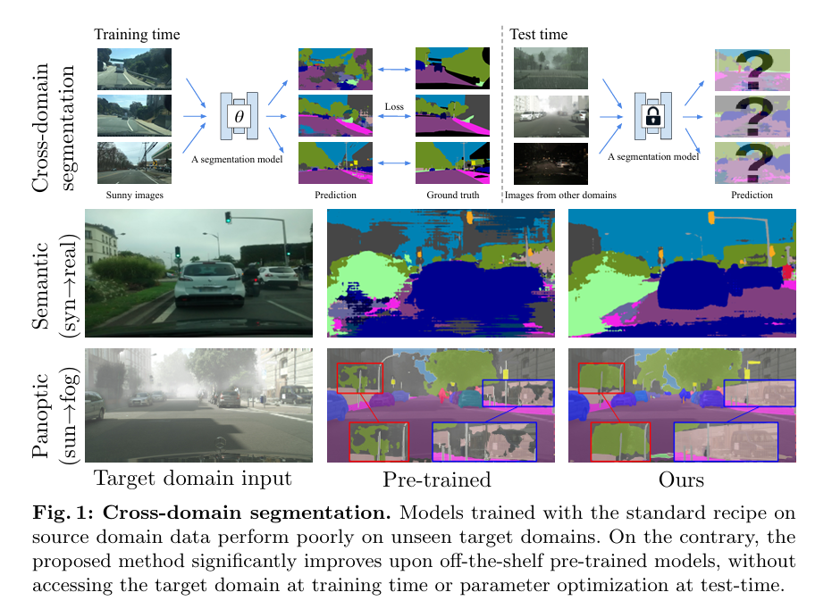

# Test-Time Instance Adaptation

<b>Test-Time Input Adaptation (TTIA) refers to a category of techniques designed to address the input distribution shift problem, where the feature distribution encountered during model deployment frequently diverges from the distribution observed in the training data. Conventional approaches typically struggle to maintain robust performance and prediction reliability under such conditions. 

This collection features representative papers from recent years in this field, spanning diverse applications such as medical image classification, long-tailed recognition, and federated learning.
# Test-Time Adaptation & Domain Generalization Papers

## Image classification

---

### `SSGen` [Xiao et al., **ICLR 2022**]  
**Learning to generalize across domains on single test samples**  
[📄 PDF](https://arxiv.org/abs/2202.08045) · [🔍 G-Scholar](https://scholar.google.com/scholar?cluster=10799367073706985191&hl=en) · [💻 CODE](https://github.com/zzzx1224/SingleSampleGeneralization-ICLR2022)

📌 Abstract · Contributions · Datasets & Methods

#### 🧠 Abstract
We strive to learn a model from a set of source domains that generalizes well to unseen target domains. The main challenge in such a domain generalization scenario is the unavailability of any target domain data during training, resulting in the learned model not being explicitly adapted to the unseen target domains. We propose learning to generalize across domains on single test samples. We leverage a meta-learning paradigm to learn our model to acquire the ability of adaptation with single samples at training time so as to further adapt itself to each single test sample at test time. We formulate the adaptation to the single test sample as a variational Bayesian inference problem, which incorporates the test sample as a conditional into the generation of model parameters. The adaptation to each test sample requires only one feed-forward computation at test time without any fine-tuning or self-supervised training on additional data from the unseen domains. Extensive ablation studies demonstrate that our model learns the ability to adapt models to each single sample by mimicking domain shifts during training. Further, our model achieves at least comparable– and often better– performance than state-of-the-art methods on multiple benchmarks for domain generalization 1.

#### 🎯 Contributions
To be specific, we build our model under the meta-learning framework and formulate the single sample generalization as a variational inference problem. In the training stage, we divide the source domains into several meta-source domains and a meta-target domain and explore the adaptive model by incorporating the information of the meta-target sample into the generation of the model parameters. For any given meta-target sample, we propose a variational distribution generated by this sample and the meta-source data to approximate the model distribution obtained by the meta-target data. In the test phase, the adapted models for the samples from the real target domains are generated on the fly by the variational model distribution. The random splits of the meta-source and meta-target domains expose the model to domain shifts and mimic the real generalization process from source domains to the target domain. Thus, the model is endowed with the ability to adapt to any unseen sample by end-to-end training with the source data only. By doing so, our method does not need to introduce any extra target data or fine-tuning operations on the target domain.

#### 🖼️ Method Overview

  
  

---

### `MEMO` [Zhang et al., **NeurIPS 2022**]  
**MEMO: Test time robustness via adaptation and augmentation**  
[📄 PDF](https://openreview.net/forum?id=XrGEkCOREX2) · [🔍 G-Scholar](https://scholar.google.com/scholar?cluster=1448618539109048791&hl=en) · [💻 CODE](https://github.com/zhangmarvin/memo)

📌 Abstract · Contributions · Datasets & Methods

#### 🧠 Abstract
While deep neural networks can attain good accuracy on in-distribution test points, many applications require robustness even in the face of unexpected perturbations in the input, changes in the domain, or other sources of distribution shift. We study the problem of test time robustification, i.e., using the test input to improve model robustness. Recent prior works have proposed methods for test time adaptation, however, they each introduce additional assumptions, such as access to multiple test points, that prevent widespread adoption. In this work, we aim to study and devise methods that make no assumptions about the model training process and are broadly applicable at test time. We propose a simple approach that can be used in any test setting where the model is probabilistic and adaptable: when presented with a test example, perform different data augmentations on the data point, and then adapt (all of) the model parameters by minimizing the entropy of the model’s average, or marginal, output distribution across the augmentations. Intuitively, this objective encourages the model to make the same prediction across different augmentations, thus enforcing the invariances encoded in these augmentations, while also maintaining confidence in its predictions. In our experiments, we evaluate two baseline ResNet models, two robust ResNet-50 models, and a robust vision transformer model, and we demonstrate that this approach achieves accuracy gains of 1-8% over standard model evaluation and also generally outperforms prior augmentation and adaptation strategies. For the setting in which only one test point is available, we achieve state-of-the-art results on the ImageNet-C, ImageNet-R, and, among ResNet-50 models, ImageNet-A distribution shift benchmarks.

#### 🎯 Contributions
We refer to the proposed method as marginal entropy minimization with one test point (MEMO), and this is the primary contribution of our work. MEMO makes direct use of pretrained models without any assumptions about their particular training procedure or architecture, while requiring only a single test input for adaptation. In Section 4, we demonstrate empirically that MEMO consistently improves the performance of ResNet [11] and vision transformer [7] models on several challenging ImageNet distribution shift benchmarks, achieving several new state-of-the-art results for these models in the setting in which only one test point is available. MEMO consistently outperforms non-adaptive marginal distribution predictions (between 1–10% improvement) on the ImageNet-C [12] and ImageNet-R [14] test sets, indicating that adaptation plays a crucial role in improving predictive accuracy. MEMO encourages both invariance across augmentations and confident predictions, and an ablation study in Section 4 shows that both components are important for maximal performance gains. Also, MEMO is, to the best of our knowledge, the first adaptation method to improve performance (by 1–4% over standard model evaluation) on the ImageNet-A test set [15].

#### 🖼️ Method Overview

  
   
  

---

### `TTT-MAE` [Gandelsman et al., **NeurIPS 2022**]  
**Test-time training with masked autoencoders**  
[📄 PDF](https://openreview.net/forum?id=SHMi1b7sjXk) · [🔍 G-Scholar](https://scholar.google.com/scholar?cluster=2544097260576053446&hl=en) · [💻 CODE](https://github.com/yossigandelsman/test_time_training_mae)

📌 Abstract · Contributions · Datasets & Methods

#### 🧠 Abstract
Test-time training adapts to a new test distribution on the fly by optimizing a model for each test input using self-supervision. In this paper, we use masked autoencoders for this one-sample learning problem. Empirically, our simple method improves generalization on many visual benchmarks for distribution shifts. Theoretically, we characterize this improvement in terms of the bias-variance trade-off

#### 🖼️ Method Overview

  

---

### `DDG` [Sun et al., **IJCAI 2022**]  
**Dynamic domain generalization**  
[📄 PDF](https://arxiv.org/abs/2205.13913) · [🔍 G-Scholar](https://scholar.google.com/scholar?cluster=4234489258058037285&hl=en) · [💻 CODE](https://github.com/MetaVisionLab/DDG)

📌 Abstract · Contributions · Datasets & Methods

#### 🧠 Abstract
Domain generalization (DG) is a fundamental yet very challenging research topic in machine learning. The existing arts mainly focus on learning domain-invariant features with limited source domains in a static model. Unfortunately, there is a lack of training-free mechanism to adjust the model when generalized to the agnostic target domains. To tackle this problem, we develop a brand-new DG variant, namely Dynamic Domain Generalization (DDG), in which the model learns to twist the network parameters to adapt the data from different domains. Specifically, we leverage a meta-adjuster to twist the network parameters based on the static model with respect to different data from different domains. In this way, the static model is optimized to learn domain-shared features, while the meta-adjuster is designed to learn domain-specific features. To enable this process, DomainMix is exploited to simulate data from diverse domains during teaching the meta-adjuster to adapt the upcoming agnostic target domains. This learning mechanism urges the model to generalize to different agnostic target domains via adjusting the model without training. Extensive experiments demonstrate the effectiveness of our proposed method.

#### 🎯 Contributions
We propose a new DG variant, **Dynamic Domain Generalization (DDG)**. As shown in Figure 1, different from DA, DG, as well as test-time DG methods, the proposed DDG is attached with a **meta-adjuster**, which learns to adapt novel domains during pre-training and twists the model during testing without any fine-tuning. To drive the process of learning to adapt, we need to collect training data from numerous novel domains, while in reality we are usually hindered by limited source domains. A simple yet friendly solution is to simulate novel samples from the limited source domains via a random convex interpolation among different source domains — termed **DomainMix**. In this way, each simulated sample is restricted to a unique domain. As a consequence, the domain-aware meta-adjuster can be relaxed into an **instance-aware meta-adjuster**, which modulates the network parameters per instance.

Additionally, the model more easily adapts from source domains to agnostic target domains with undefinable domain distinction, by discarding the utilization of domain labels during the optimization of the meta-adjuster. Beyond the optimization pipeline, another critical factor is how to **design the meta-adjuster**. To disentangle domain-shared and domain-specific features, network parameters are **decoupled into a static part and a dynamic part**, the latter generated per instance by the meta-adjuster. The dynamic parameters are decomposed into a linear combination of several **kernel templates** with low-dimensional dynamic coefficients. These coefficients are generated dynamically by the meta-adjuster from instance embeddings. As shown in Figure 3, the kernel templates are designed as **four asymmetric kernels** to strengthen the spatial and channel structure, regularizing the meta-adjuster to generate diverse parameters capable of adapting to a wide range of unseen samples.

#### 🖼️ Method Overview

  
   
  
   
  

---

### `TAF-Cal` [Zhao et al., **IJCAI 2022**]  
**Test-time fourier style calibration for domain generalization**  
[📄 PDF](https://arxiv.org/abs/2205.06427) · [🔍 G-Scholar](https://scholar.google.com/scholar?cluster=15047408040728759993&hl=en) · [💻 CODE](https://github.com/xingchenzhao/TAF-Cal)

📌 Abstract · Contributions · Datasets & Methods

  #### 🧠 Abstract
The topic of generalizing machine learning models learned on a collection of source domains to unknown target domains is challenging. While many domain generalization (DG) methods have achieved promising results, they primarily rely on the source domains at train-time without manipulating the target domains at test-time. Thus, it is still possible that those methods can overfit to source domains and perform poorly on target domains. Driven by the observation that domains are strongly related to styles, we argue that reducing the gap between source and target styles can boost models’ generalizability. To solve the dilemma of having no access to the target domain during training, we introduce Test-time Fourier Style Calibration (TF-Cal) for calibrating the target domain style on the fly during testing. To access styles, we utilize Fourier transformation to decompose features into amplitude (style) features and phase (semantic) features. Furthermore, we present an effective technique to Augment Amplitude Features (AAF) to complement TF-Cal. Extensive experiments on several popular DG benchmarks and a segmentation dataset for medical images demonstrate that our method outperforms state-of-the-art methods.

#### 🎯 Contributions
In this paper, we propose a novel yet simple method called Test-time Fourier Style Calibration (TF-Cal) to calibrate the target style features at inference-time. Our method is driven by the assumption that the lack of generalizability is due to the difference in styles of images (e.g., sketches, cartoon, photo) between the source and target [Zhou et al., 2021]. Based on this idea, we employ Fourier transformation to decompose latent features from early CNN layers into amplitude features and phase features. The amplitude encodes the intensities (style information), while the phase encodes the spatial positions (semantic information) [Piotrowski and Campbell, 1982]. To achieve test-time style calibration, we propose to convexly calibrate the target amplitude features using the source amplitude prototype estimated at train-time. Hence we narrow the style gap between the target and source domains on the fly when evaluating, while retaining the key semantic feature for classification. We additionally show that increasing the diversity of features can complement TF-Cal to further boost models’ generalizability based on the convex hull theory proposed by [Albuquerque et al., 2019]. Inspired by [Xu et al., 2021] which augments amplitude in image space, we propose augmenting amplitude in feature space (AAF) that diversifies higher-level styles, while preserving semantics. Then we have the Test-time Augmentated Fourier Style Calibration (TAF-Cal) by combining TF-Cal and AAF. Moreover, our algorithm does not require domain labels, allowing for more data collection flexibility.

#### 📂 Datasets

For the white matter hyperintensity segmentation task, we use the MICCAI WMH Challenge dataset [Kuijf et al., 2019], which includes three domains: Utrecht, Amsterdam, and Singapore. Each domain contains 20 subjects. For each subject, Utrecht and Singapore provide 47 slices, while Amsterdam provides 82 slices. The primary domain shift arises from differences in scanner hardware and imaging protocols across the centers.

 

#### 🖼️ Method Overview

  

---

### `TTCP++` [Sarkar et al., **WACV 2022**]  
**Leveraging test-time consensus prediction for robustness against unseen noise**  
[📄 PDF](https://openaccess.thecvf.com/content/WACV2022/html/Sarkar_Leveraging_Test-Time_Consensus_Prediction_for_Robustness_Against_Unseen_Noise_WACV_2022_paper.html) · [🔍 G-Scholar](https://scholar.google.com/scholar?cluster=3457983965127110405&hl=en)

📌 Abstract · Contributions · Datasets & Methods

  #### 🧠 Abstract
We propose a method to improve DNN robustness against unseen noisy corruptions, such as Gaussian noise, Shot Noise, Impulse Noise, Speckle noise with different levels of severity by leveraging ensemble technique through a consensus-based prediction method using self-supervised learning at inference time. We also propose to enhance the model training by considering other aspects of the issue, i.e., noise in data and better representation learning, which shows even better generalization performance with the consensus-based prediction strategy. We report results of each noisy corruption on the standard CIFAR10-C and ImageNet-C benchmarks, which show significant boost in performance over previous methods. We also introduce results for MNIST-C and TinyImageNet-C to show the usefulness of our method across datasets of different complexities to provide robustness against unseen noise. We show results with different architectures to validate our method against other baseline methods and also conduct experiments to show the usefulness of each part of our method.

#### 🎯 Contributions
- We propose a novel **Test-Time Consensus Prediction (TTCP)** strategy to achieve better model robustness through improved generalization performance against unseen noise.
- We propose an extended framework, **TTCP++**, to exploit quantized latents and knowledge distillation in the training phase, further boosting the performance of the proposed TTCP method on unseen noise.
- Our results on **CIFAR10-C** and **ImageNet-C** show significant improvements over previous methods based on improved training. We also study our method on **MNIST-C** and **TinyImageNet-C** datasets — the first such results in this context — and report strong performance.
- We perform consistently against all kinds of noise on CIFAR10-C and ImageNet-C compared to augmentation-based methods, **even without any data augmentation and using only clean training data**.
- We present detailed **ablation studies** showing the usefulness of each component in our overall **TTCP++** framework.

#### 🖼️ Method Overview

  
  

  
  

  

---

### `TTN` [Lim et al., **ICLR 2023**]  
**TTN: A domain-shift aware batch normalization in test-time adaptation**  
[📄 PDF](https://openreview.net/forum?id=EQfeudmWLQ) · [🔍 G-Scholar](https://scholar.google.com/scholar?cluster=12984514498411836030&hl=en)

📌 Abstract · Contributions · Datasets & Methods

  #### 🧠 Abstract
This paper proposes a novel batch normalization strategy for test-time adaptation.  
Recent test-time adaptation (TTA) methods heavily rely on modified batch normalization, particularly **Transductive Batch Normalization (TBN)**, which recalculates the mean and variance from the test batch rather than using the running statistics from source data as in **Conventional Batch Normalization (CBN)**. Although TBN mitigates performance degradation under domain shift, it suffers when assumptions like large and i.i.d. test batches are violated.  
We identify a trade-off between CBN and TBN and introduce **Test-Time Normalization (TTN)** — a method that interpolates between CBN and TBN using layer-wise, domain-shift sensitivity-based weights. TTN is robust across a wide range of test batch sizes and evaluation scenarios. Moreover, TTN can be integrated into other TTA frameworks to further boost their performance. Extensive experiments demonstrate that TTN achieves state-of-the-art results across multiple benchmarks.

#### 🎯 Contributions
- We propose a **domain-shift-aware Test-Time Normalization (TTN)** layer that interpolates between source (CBN) and test (TBN) statistics using channel-wise weights, dynamically adjusted based on domain-shift sensitivity per BN layer.
- TTN **requires no modification** to training or test-time schemes and can be directly applied to existing TTA methods. It significantly improves performance across a wide range of test batch sizes (from 200 to 1) and evaluation settings including:
  - **Stationary domain adaptation**
  - **Continuously changing domains**
  - **Mixed domain scenarios**
- We demonstrate TTN’s effectiveness in both **image classification** and **semantic segmentation** tasks across diverse datasets.

#### 🖼️ Method Overview

  

  

 

---

### `ESA` [Xiao et al., **ICLR 2023**]  
**Energy-based test sample adaptation for domain generalization**  
[📄 PDF](https://openreview.net/forum?id=3dnrKbeVatv) · [🔍 G-Scholar](https://scholar.google.com/scholar?cluster=3027943185987486652&hl=en)

📌 Abstract · Contributions · Datasets & Methods

  #### 🧠 Abstract  
In this paper, we propose energy-based sample adaptation at test time for domain generalization. Where previous works adapt their models to target domains, we adapt the unseen target samples to source-trained models. To this end, we design a discriminative energy-based model, which is trained on source domains to jointly model the conditional distribution for classification and data distribution for sample adaptation. The model is optimized to simultaneously learn a classifier and an energy function. To adapt target samples to source distributions, we iteratively update the samples by energy minimization with stochastic gradient Langevin dynamics. Moreover, to preserve the categorical information in the sample during adaptation, we introduce a categorical latent variable into the energy-based model. The latent variable is learned from the original sample before adaptation by variational inference and fixed as a condition to guide the sample update. Experiments on six benchmarks for classification of images and microblog threads demonstrate the effectiveness of our proposal.

#### 🎯 Contributions  
In this paper, we propose energy-based test sample adaptation for domain generalization. The method is motivated by the fact that energy-based models (Hinton, 2002; LeCun et al., 2006) flexibly model complex data distributions and allow for efficient sampling from the modeled distribution by Langevin dynamics (Du & Mordatch, 2019; Welling & Teh, 2011). Specifically, we define a new discriminative energy-based model as the composition of a classifier and a neural-network-based energy function in the data space, which are trained simultaneously on the source domains. The trained model iteratively updates the representation of each target sample by gradient descent of energy minimization through Langevin dynamics, which eventually adapts the sample to the source data distribution. The adapted target samples are then predicted by the classifier that is simultaneously trained in the discriminative energy-based model. For both efficient energy minimization and classification, we deploy the energy functions on the input feature space rather than the raw images.

#### 🖼️ Method Overview

  

  

 

---

### `TSB` [Park et al., **ICML 2023**]  
**Test-time style shifting: Handling arbitrary styles in domain generalization**  
[📄 PDF](https://arxiv.org/abs/2306.04911)

📌 Abstract · Contributions · Datasets & Methods

  #### 🧠 Abstract  
In domain generalization (DG), the target domain is unknown when the model is being trained, and the trained model should successfully work on an arbitrary (and possibly unseen) target domain during inference. This is a difficult problem, and despite active studies in recent years, it remains a great challenge. In this paper, we take a simple yet effective approach to tackle this issue. We propose test-time style shifting, which shifts the style of the test sample (that has a large style gap with the source domains) to the nearest source domain that the model is already familiar with, before making the prediction. This strategy enables the model to handle any target domains with arbitrary style statistics, without additional model update at test-time. Additionally, we propose style balancing, which provides a great platform for maximizing the advantage of test-time style shifting by handling the DG-specific imbalance issues. The proposed ideas are easy to implement and successfully work in conjunction with various other DG schemes. Experimental results on different datasets show the effectiveness of our methods.

#### 🎯 Contributions  
In this paper, we take a simple yet effective approach to improve the DG performance when there is a significant domain shift between the source and target domains. Specifically, in order to handle arbitrary target domains during inference, we propose test-time style shifting, which shifts the style of the test sample (that has a large style gap with the source domains) to the nearest source domain that the model is already familiar with, before making the prediction. Note that our scheme only performs style shifting in the style-space and thus does not require any model updates at test-time. Moreover, our test-time style shifting does not require additional changes in the model architecture or the objective function, making our scheme to be more compatible with any tasks/models.  
In order to maximize the effectiveness of test-time style shifting, the model should be well-trained on the styles of the source domains. Motivated by this, we also propose style balancing, which provides a great platform to increase the potential of test-time style shifting by handling the DG-specific imbalance issues. Note that in DG scenarios with multiple domains, the imbalance issues have different characteristics compared to the traditional class imbalance problem in a single domain; when a specific domain lacks certain classes, it turns out, as will seen in Section 5.3, that existing methods based on resampling or reweighting fail to handle these DG-specific imbalance issues.  
Our proposed style balancing handles this issue by choosing the sample that has similar style statistics to other samples (and thus has a similar role compared to others) in the same domain, and converting the style of this sample to another domain; this improves the domain diversity per classes during training by compensating for the missing classes in each domain.  
Our test-time style shifting and style balancing work in a highly complementary fashion; style balancing plays a key role in improving the performance of test-time style shifting by exposing the model to various styles per classes during training. Moreover, removing one of these components can degrade the performance in practice having (i) DG-specific imbalance issues and (ii) large domain shift between source and target at the same time.  
Our solution is compatible with not only the style-augmentation based DG schemes (e.g., MixStyle, DSU, EFDMix) that operate in the style space as ours, but also other DG ideas relying on domain alignment or meta-learning. Extensive experimental results on various DG benchmarks show the improved performance of our scheme over existing methods.

#### 🖼️ Method Overview

  

  

---

### `PromptAlign` [Samadh et al., **NeurIPS 2023**]  
**Align your prompts: Test-time prompting with distribution alignment for zero-shot generalization**  
[📄 PDF](https://arxiv.org/abs/2311.01459) · [🔍 G-Scholar](https://scholar.google.com/scholar?cluster=3235088620563898394&hl=en) · [💻 CODE](https://github.com/jameelhassan/PromptAlign)

📌 Abstract · Contributions · Datasets & Methods

  #### 🧠 Abstract  
The promising zero-shot generalization of vision-language models such as CLIP has led to their adoption using prompt learning for numerous downstream tasks. Previous works have shown test-time prompt tuning using entropy minimization to adapt text prompts for unseen domains. While effective, this overlooks the key cause for performance degradation to unseen domains– distribution shift. In this work, we explicitly handle this problem by aligning the out-of-distribution (OOD) test sample statistics to those of the source data using prompt tuning. We use a single test sample to adapt multi-modal prompts at test time by minimizing the feature distribution shift to bridge the gap in the test domain. Evaluating against the domain generalization benchmark, our method improves zero-shot top-1 accuracy beyond existing prompt-learning techniques, with a 3.08% improvement over the baseline MaPLe. In cross-dataset generalization with unseen categories across 10 datasets, our method improves consistently across all datasets compared to the existing state-of-the-art. Our source code and models are available at https://jameelhassan.github.io/promptalign/

#### 🎯 Contributions  
• The proposed strategy formulates a distribution alignment loss that utilizes offline computed source data statistics to encourage the test sample token distributions to be aligned with the source data token distributions. We harmonically combine the benefits of token distribution alignment and entropy minimization using a multi-modal prompt learning approach.  
• Since CLIP-pre-training data is not publicly released, we study the statistics of ImageNet as a possible candidate for the source distribution, and our empirical results show that ImageNet is an effective proxy source dataset for large-scale V-L models such as CLIP.  
• We validate our method PromptAlign through extensive experiments in domain generalization and cross-dataset benchmarks. PromptAlign improves the generalization of CLIP at test time beyond existing prompt-tuning methods, achieving state-of-the-art results.

#### 🖼️ Method Overview

  

  

---

### `Diffusion-TTA` [Prabhudesai et al., **NeurIPS 2023**]  
**Test-time adaptation of discriminative models via diffusion generative feedback**  
[📄 PDF](https://openreview.net/forum?id=gUTVpByfVX) · [💻 CODE](https://github.com/mihirp1998/Diffusion-TTA)

📌 Abstract · Contributions · Datasets & Methods

  #### 🧠 Abstract  
The advancements in generative modeling, particularly the advent of diffusion models, have sparked a fundamental question: how can these models be effectively used for discriminative tasks? In this work, we find that generative models can be great test-time adapters for discriminative models. Our method, Diffusion-TTA, adapts pre-trained discriminative models such as image classifiers, segmenters and depth predictors, to each unlabelled example in the test set using generative feedback from a diffusion model. We achieve this by modulating the conditioning of the diffusion model using the output of the discriminative model. We then maximize the image likelihood objective by backpropagating the gradients to discriminative model’s parameters. We show Diffusion-TTA significantly enhances the accuracy of various large-scale pre-trained discriminative models, such as, ImageNet classifiers, CLIP models, image pixel labellers and image depth predictors. Diffusion-TTA outperforms existing test-time adaptation methods, including TTT-MAE and TENT, and particularly shines in online adaptation setups, where the discriminative model is continually adapted to each example in the test set. We provide access to code, results, and visualizations on our website: [diffusion-tta.github.io](https://diffusion-tta.github.io/).

#### 🎯 Contributions  
We present Diffusion-based Test Time Adaptation (TTA) (Diffusion-TTA), a method that adapts discriminative models, such as image classifiers, segmenters and depth predictors, to individual unlabelled images by using their outputs to modulate the conditioning of an image diffusion model and maximize the image diffusion likelihood. This operates as an inversion of the generative model, to infer the discriminative weights that result in the discriminative hypothesis with the highest conditional image likelihood. Our model is reminiscent of an encoder-decoder architecture, where a pre-trained discriminative model encodes the image into a hypothesis, such as an object category label, segmentation map, or depth map, which is used as conditioning to a pre-trained generative model to generate back the image. We show that Diffusion-TTA effectively adapts image classifiers for both in- and out-of-distribution examples across established benchmarks, including ImageNet and its variants, as well as image segmenters and depth predictors in ADE20K and NYU Depth dataset.
#### 🖼️ Method Overview

  

  

---

### `DDA` [Gao et al., **CVPR 2023**]  
**Back to the source: Diffusion-driven adaptation to test-time corruption**  
[📄 PDF](https://arxiv.org/abs/2207.03442) · [🔍 G-Scholar](https://scholar.google.com/scholar?cluster=8145404192355562400&hl=en) · [💻 CODE](https://github.com/shiyegao/DDA)

📌 Abstract · Contributions · Datasets & Methods

  #### 🧠 Abstract  
Test-time adaptation harnesses test inputs to improve the accuracy of a model trained on source data when tested on shifted target data. Most methods update the source model by (re-)training on each target domain. While re-training can help, it is sensitive to the amount and order of the data and the hyperparameters for optimization. We update the target data instead, and project all test inputs toward the source domain with a generative diffusion model. Our diffusion-driven adaptation (DDA) method shares its models for classification and generation across all domains, training both on source then freezing them for all targets, to avoid expensive domain-wise re-training. We augment diffusion with image guidance and classifier self-ensembling to automatically decide how much to adapt. Input adaptation by DDA is more robust than model adaptation across a variety of corruptions, models, and data regimes on the ImageNet-C benchmark. With its input-wise updates, DDA succeeds where model adaptation degrades on too little data (small batches), on dependent data (correlated orders), or on mixed data (multiple corruptions).

#### 🎯 Contributions  
• We propose DDA as the first diffusion-based method for test-time adaptation to corruption and include a novel self-ensembling scheme to choose how much to adapt.  
• We identify and empirically confirm weak points for online model updates—small batches, ordered data, and mixed targets—and highlight how input updates address these natural but currently challenging regimes.  
• We experiment on the ImageNet-C benchmark to show that DDA improves over existing test-time adaptation methods across corruptions, models, and data regimes.

#### 🖼️ Method Overview

  

  

  

---

### `IAI` [Jeon et al., **ICCV 2023**]  
**A unified framework for robustness on diverse sampling errors**  
[📄 PDF](https://openaccess.thecvf.com/content/ICCV2023/html/Jeon_A_Unified_Framework_for_Robustness_on_Diverse_Sampling_Errors_ICCV_2023_paper.html) · [🔍 G-Scholar](https://scholar.google.com/scholar?cluster=9460419101326058787&hl=en)

📌 Abstract · Contributions · Datasets & Methods

  #### 🧠 Abstract  
Recent studies have substantiated that machine learning algorithms including convolutional neural networks often suffer from unreliable generalizations when there is a significant gap between the source and target data distributions. To mitigate this issue, a predetermined distribution shift has been addressed independently (e.g., single domain generalization, de-biasing). However, a distribution mismatch cannot be clearly estimated because the target distribution is unknown at training. Therefore, a conservative approach robust on unexpected diverse distributions is more desirable in practice. Our work starts from a motivation to allow adaptive inference once we know the target, since it is accessible only at testing. Instead of assuming and fixing the target distribution at training, our proposed approach allows adjusting the feature space the model refers to at every prediction, i.e., instance-wise adaptive inference. The extensive evaluation demonstrates our method is effective for generalization on diverse distributions.

#### 🎯 Contributions  
• We present a novel framework for robust learning on arbitrary diverse distributions. This is desirable in scenarios where a model is deployed in a dynamic environment where queries often drift while the model cannot be frequently revised.  
• We propose a novel method that exploits adaptive inference re-weighting instance-wise on disentangled representations in widened feature space. Extensive evaluations demonstrate our method is robust on diverse distributions.
#### 🖼️ Method Overview

  

  

  
  

---

### `TT-NSS` [Mehra et al., **ICML Workshops 2023**]  
**Risk-averse predictions on unseen domains via neural style smoothing**  
[📄 PDF](https://openreview.net/forum?id=YVwW5yBISo)

📌 Abstract · Contributions · Datasets & Methods

  #### 🧠 Abstract  
Achieving high accuracy on data from domains unseen during training is a fundamental challenge in machine learning. While state-of-the-art neural networks have achieved impressive performance on various tasks, their predictions are biased towards domain-dependent information (e.g., image styles) rather than domain-invariant information (e.g., image content). This makes them unreliable for deployment in risk-sensitive settings such as autonomous driving. In this work, we propose a novel inference procedure, Test-Time Neural Style Smoothing (TT-NSS), that produces risk-averse predictions using a “style smoothed” version of a classifier. Specifically, the style-smoothed classifier classifies a test image as the most probable class predicted by the original classifier on random re-stylizations of the test image. TT-NSS uses a neural style transfer module to stylize the test image on the fly, requires black-box access to the classifier, and crucially, abstains when predictions of the original classifier on the stylized images lack consensus. We further propose a neural style smoothing-based training procedure that improves the prediction consistency and the performance of the style-smoothed classifier on non-abstained samples. Our experiments on the PACS dataset and its variations, both in single and multiple source domain settings, highlight the effectiveness of our methods at producing risk-averse predictions on unseen domains.

#### 🎯 Contributions  
• We propose a simple and effective inference procedure based on neural style smoothing for obtaining risk-averse predictions. Our method returns the prediction of the style-smoothed classifier in real time with only black-box access to the underlying classifier.  
• We propose a novel training procedure to improve the performance of style-smoothed classifier by incorporating neural style smoothing during training and enforcing prediction consistency under random stylizations of the source domain data.  
• We evaluate the effectiveness of methods on benchmark datasets and their novel variations created by stylizing and applying common corruptions to them.

#### 🖼️ Method Overview

  

  

  

---

### `GDA` [Tsai et al., **CVPR 2024**]  
**GDA: Generalized diffusion for robust test-time adaptation**  
[📄 PDF](https://arxiv.org/abs/2404.00095) · [🔍 G-Scholar](https://scholar.google.com/scholar?cluster=10549928891728768790&hl=en)

📌 Abstract · Contributions · Datasets & Methods

  
#### 🧠 Abstract  
Machine learning models face generalization challenges when exposed to out-of-distribution (OOD) samples with unforeseen distribution shifts. Recent research reveals that for vision tasks, test-time adaptation employing diffusion models can achieve state-of-the-art accuracy improvements on OOD samples by generating domain-aligned samples without altering the model’s weights. Unfortunately, those studies have primarily focused on pixel-level corruptions, thereby lacking the generalization to adapt to a broader range of OOD types. We introduce Generalized Diffusion Adaptation (GDA), a novel diffusion-based test-time adaptation method robust against diverse OOD types. Specifically, GDA iteratively guides the diffusion by applying a marginal entropy loss derived from the model, in conjunction with style and content preservation losses during the reverse sampling process. In other words, GDA considers the model’s output behavior and the samples’ semantic information as a whole, reducing ambiguity in downstream tasks. Evaluation across various model architectures and OOD benchmarks indicates that GDA consistently surpasses previous diffusion-based adaptation methods. Notably, it achieves the highest classification accuracy improvements, ranging from 4.4% to 5.02% on ImageNet-C and 2.5% to 7.4% on Rendition, Sketch, and Stylized benchmarks. This performance highlights GDA’s generalization to a broader range of OOD benchmarks.

#### 🎯 Contributions  
• We propose Generalized Diffusion Adaptation (GDA), a new diffusion-based adaptation method that generalizes to multiple local-texture and style-shifting OOD benchmarks, including ImageNet-C, Rendition, Sketch, and Stylized ImageNet.  
• Our key innovation is a new structural guidance towards minimizing marginal entropy, style, and content preservation loss. We demonstrate that our guidance is both effective and efficient as GDA reaches higher or on-par accuracy with fewer reverse sampling steps.  
• GDA outperforms state-of-the-art TTA methods, including DDA [5] and Diffpure [30] on four datasets with respect to target classifiers of different network backbones (ResNet50 [8], ConvNext [23], Swin [22], CLIP [34]).  
• Ablation studies show that GDA indeed minimizes the entropy loss, enhances the corrupted samples, and recovers the correct attention of the target classifier.

#### 🖼️ Method Overview

  

  

  
---

### `MoDE` [Ma et al., **CVPR 2024**]  
**MoDE: CLIP data experts via clustering**  
[📄 PDF](https://arxiv.org/abs/2404.16030) · [🔍 G-Scholar](https://scholar.google.com/scholar?cluster=6687597386819654107&hl=en) · [💻 CODE](https://github.com/facebookresearch/MetaCLIP/tree/main/mode)

📌 Abstract · Contributions · Datasets & Methods

  #### 🧠 Abstract  
The success of contrastive language-image pretraining (CLIP) relies on the supervision from the pairing between images and captions, which tends to be noisy in web-crawled data. We present Mixture of Data Experts (MoDE) and learn a system of CLIP data experts via clustering. Each data expert is trained on one data cluster, being less sensitive to false negative noises in other clusters. At inference time, we ensemble their outputs by applying weights determined through the correlation between task metadata and cluster conditions. To estimate the correlation precisely, the samples in one cluster should be semantically similar, but the number of data experts should still be reasonable for training and inference. As such, we consider the ontology in human language and propose to use fine-grained cluster centers to represent each data expert at a coarse-grained level. Experimental studies show that four CLIP data experts on ViT-B/16 outperform the ViT-L/14 by OpenAI CLIP and OpenCLIP on zero-shot image classification but with less (<35%) training cost. Meanwhile, MoDE can train all data expert asynchronously and can flexibly include new data experts. The code is available at: https://github.com/facebookresearch/MetaCLIP/tree/main/mode

#### 🎯 Contributions  
• We investigate the quality of negative samples in contrastive language-image pretraining, and in particular, the noise of false negatives in web-crawled image-caption pairs.  
• We propose the MoDE framework to learn a system of CLIP data experts via clustering, and adaptively ensemble data experts for downstream tasks at inference time.  
• Extensive experimental study has demonstrated the effects in zero-shot transfer benchmarks with low training cost. MoDE can include new data experts flexibly and is thus beneficial for continual pre-training.

#### 🖼️ Method Overview

  
  

  
---

### `CloudFixer` [Shim et al., **ECCV 2024**]  
**CloudFixer: Test-time adaptation for 3D point clouds via diffusion-guided geometric transformation**  
[📄 PDF](https://arxiv.org/abs/2407.16193) · [🔍 G-Scholar](https://scholar.google.com/scholar?cluster=4842877858434940251&hl=en) · [💻 CODE](https://github.com/shimazing/CloudFixer)

📌 Abstract · Contributions · Datasets & Methods

  #### 🧠 Abstract  
3D point clouds captured from real-world sensors frequently encompass noisy points due to various obstacles, such as occlusion, limited resolution, and variations in scale. These challenges hinder the deployment of pre-trained point cloud recognition models trained on clean point clouds, leading to significant performance degradation. While test-time adaptation (TTA) strategies have shown promising results on this issue in the 2D domain, their application to 3D point clouds remains underexplored. Among TTA methods, an input adaptation approach, which directly converts test instances to the source domain using a pre-trained diffusion model, has been proposed in the 2D domain. Despite its robust TTA performance in practical situations, naively adopting this into the 3D domain may be suboptimal due to the neglect of inherent properties of point clouds, and its prohibitive computational cost. Motivated by these limitations, we propose **CloudFixer**, a test-time input adaptation method tailored for 3D point clouds, employing a pre-trained diffusion model. Specifically, CloudFixer optimizes geometric transformation parameters with carefully designed objectives that leverage the geometric properties of point clouds. We also substantially improve computational efficiency by avoiding backpropagation through the diffusion model and a prohibitive generation process. Furthermore, we propose an online model adaptation strategy by aligning the original model prediction with that of the adapted input. Extensive experiments showcase the superiority of CloudFixer over various TTA baselines, excelling in handling common corruptions and natural distribution shifts across diverse real-world scenarios. Our code is available at https://github.com/shimazing/CloudFixer.

#### 🎯 Contributions  
• We propose **CloudFixer**, which is the first test-time input adaptation strategy tailored for 3D point clouds, proposing domain-specific parameterization and objective, harnessing pre-trained diffusion models.  
• CloudFixer is well-suited for real-time 3D applications as it requires neither backpropagation through the diffusion model nor an excessive generation process, enabling it to adapt a single instance in less than 1 second.  
• Through extensive experiments, we demonstrate that our method achieves state-of-the-art performance across diverse distribution shift scenarios, encompassing common corruptions and natural distribution shifts.

#### 🖼️ Method Overview

  

  ---

### `TPS` [Sui et al., **CVPR Workshops 2024**]  
**Just shift it: Test-time prototype shifting for zero-shot generalization with vision-language models**  
[📄 PDF](https://arxiv.org/abs/2403.12952) · [🔍 G-Scholar](https://scholar.google.com/scholar?cluster=15629234813577501375&hl=en) · [💻 CODE](https://github.com/elaine-sui/TPS)

📌 Abstract · Contributions · Datasets & Methods

  #### 🧠 Abstract  
Advancements in vision-language models (VLMs) have propelled the field of computer vision, particularly in the zero-shot learning setting. Despite their promise, the effectiveness of these models often diminishes due to domain shifts in test environments. To address this, we introduce the **Test-Time Prototype Shifting (TPS)** framework, a pioneering approach designed to adapt VLMs to test datasets using unlabeled test inputs. Our method is based on the notion of modulating per-class prototypes in the shared embedding space. By pre-computing and caching prototypes generated with the pre-trained text encoder, TPS not only facilitates optimization-free prototype reuse for subsequent predictions but also enables seamless integration with current advancements in prompt engineering. At test-time, TPS dynamically learns shift vectors for each prototype based solely on the given test sample, effectively bridging the domain gap and enhancing classification accuracy. A notable aspect of our framework is its significantly reduced memory and computational demands when compared to conventional text-prompt tuning methods. Extensive evaluations across 15 image classification datasets involving natural distribution shifts and cross-dataset generalization, as well as in context-dependent visual reasoning, demonstrate TPS’s superior performance, achieving state-of-the-art results while reducing resource requirements. Code is available at: [https://github.com/elaine-sui/TPS](https://github.com/elaine-sui/TPS)

#### 🎯 Contributions  
1. We introduce the **Test-Time Prototype Shifting (TPS)** framework, a novel, straightforward and efficient approach. This is, to our knowledge, the first instance of utilizing feature space modulation for test-time adaptation with VLMs.  
2. Our TPS framework seamlessly integrates with existing advancements in prompt engineering, transforming it into a flexible plug-and-play system.  
3. We achieve state-of-the-art performance on image classification on both natural distribution shift and cross-dataset generalization benchmarks, surpassing current SoTA by 3.3% and 1.9%, respectively, as well as context-dependent visual reasoning, surpassing SoTA TTA methods by 1.3%. Additionally, our approach significantly reduces computational and memory demands by more than 10× compared to TPT.
#### 🖼️ Method Overview

  

  

  

---

## Segmentation
---
### `DCAC` [Hu et al., **IEEE TMI 2022**]  
Domain and content adaptive convolution based multi-source domain generalization in medical image segmentation 
[📄 PDF](https://arxiv.org/abs/2109.05676) | [🔎 Google Scholar](https://scholar.google.com/scholar?cluster=7895018487155935722&hl=en) | [💻 Code](https://github.com/ShishuaiHu/DCAC/)

📌 Abstract · Contributions · Datasets & Methods

  #### 🧠 Abstract
The domain gap caused mainly by variable medical image quality renders a major obstacle on the path between training a segmentation model in the lab and applying the trained model to unseen clinical data. To address this issue, domain generalization methods have been proposed, which however usually use static convolutions and are less flexible. In this paper, we propose a multi-source domain generalization model based on the domain and content adaptive convolution (DCAC) for the segmentation of medical images across different modalities. Specifically, we design the domain adaptive convolution (DAC) module and content adaptive convolution (CAC) module and incorporate both into an encoder-decoder backbone. In the DAC module, a dynamic convolutional head is conditioned on the predicted domain code of the input to make our model adapt to the unseen target domain. In the CAC module, a dynamic convolutional head is conditioned on the global image features to make our model adapt to the test image. We evaluated the DCAC model against the baseline and four state-of-the-art domain generalization methods on the prostate segmentation, COVID-19 lesion segmentation, and optic cup/optic disc segmentation tasks. Our results not only indicate that the proposed DCAC model outperforms all competing methods on each segmentation task but also demonstrate the effectiveness of the DAC and CAC modules. Code is available at https://git.io/DCAC.

#### 🎯 Contributions
- We used the domain-discriminative information embedded in the encoder feature maps to generate the domain code of each input image, which establishes the relationship between multiple source domains and the unseen target domain.  
- We designed the dynamic convolution-based DAC module and CAC module, which respectively enable our DCAC model to adapt not only to the unseen target domain but also to each test image.  
- We presented extensive experimental results, which demonstrate not only the effectiveness of DAC and CAC modules but also the superiority of our DCAC model over state-of-the-art domain generalization techniques on three medical image segmentation tasks.

#### 📂 Datasets

Prostate Segmentation Dataset:
This dataset includes 116 T2-weighted MRI cases collected from six different domains. The data was preprocessed to keep only the slices containing the prostate region, ensuring consistent and objective evaluation.

COVID-19 Lesion Segmentation Dataset:
It consists of 120 CT scans from RT-PCR confirmed COVID-19 patients. The scans have pixel-level lesion annotations and come from a multi-institutional, multinational expert-annotated COVID-19 image database.

OC/OD Segmentation Dataset:
This dataset contains 789 training cases and 281 test cases of fundus images. The images are sourced from four public datasets and have varying statistical characteristics.

 

#### 🖼️ Method Overview

  
  

  
  

  

---

### `InstCal` [Zou et al., **Proc. ECCV 2022**]  
**Learning instance-specific adaptation for cross-domain segmentation**  
[📄 PDF](https://link.springer.com/chapter/10.1007/978-3-031-19827-4_27) | [🔎 Google Scholar](https://scholar.google.com/scholar?cluster=3479758947644774894&hl=en) | [💻 Code](https://github.com/Yuliang-Zou/InstCal-Pano)

📌 Abstract · Contributions · Datasets & Methods

#### 🧠 Abstract
We propose a test-time adaptation method for cross-domain image segmentation. Our method is simple: Given a new unseen instance at test time, we adapt a pre-trained model by conducting instance-specific BatchNorm (statistics) calibration. Our approach has two core components. First, we replace the manually designed BatchNorm calibration rule with a learnable module. Second, we leverage strong data augmentation to simulate random domain shifts for learning the calibration rule. In contrast to existing domain adaptation methods, our method does not require accessing the target domain data at training time or conducting computationally expensive test-time model training/optimization. Equipping our method with models trained by standard recipes achieves significant improvement, comparing favorably with several state-of-the-art domain generalization and one-shot unsupervised domain adaptation approaches. Combining our method with the domain generalization methods further improves performance, reaching a new state of the art.

#### 🎯 Contributions
– We propose a simple instance-specific test-time adaptation method and show its applicability to off-the-shelf segmentation models containing BatchNorm.  
– We conduct a detailed ablation study and analysis to validate our design choices in semantic segmentation. Applying the optimal configuration to the more complex panoptic segmentation task leads to promising performance.  
– When combined with the models pre-trained by standard recipes, our method compares favorably with state-of-the-art one-shot UDA methods and domain generalizing semantic segmentation methods. Our approach can also be combined with existing DG methods to improve the performance further.

#### 🖼️ Method Overview

  

  

---

### `TASD` [Liu et al., **Proc. AAAI 2022**]  
**Single-domain generalization in medical image segmentation via test-time adaptation from shape dictionary**  
[📄 PDF](https://arxiv.org/abs/2206.14467) | [🔎 Google Scholar](https://scholar.google.com/scholar?cluster=5193566977778450536&hl=en)

📌 Abstract · Contributions · Datasets & Methods

#### 🧠 Abstract
Domain generalization typically requires data from multiple source domains for model learning. However, such strong assumption may not always hold in practice, especially in medical field where the data sharing is highly concerned and sometimes prohibitive due to privacy issue. This paper studies the important yet challenging single domain generalization problem, in which a model is learned under the worst case scenario with only one source domain to directly generalize to different unseen target domains. We present a novel approach to address this problem in medical image segmentation, which extracts and integrates the semantic shape prior information of segmentation that are invariant across domains and can be well-captured even from single domain data to facilitate segmentation under distribution shifts. Besides, a test time adaptation strategy with dual-consistency regularization is further devised to promote dynamic incorporation of these shape priors under each unseen domain to improve model generalizability. Extensive experiments on two medical image segmentation tasks demonstrate the consistent improvements of our method across various unseen domains, as well as its superiority over state-of-the-art approaches in addressing domain generalization under the worst-case scenario.

#### 🎯 Contributions
- We present a novel approach to address the challenging single domain generalization problem for medical image segmentation, by explicitly exploiting the general semantic shape priors that are extractable from single-domain data and are generalizable across domains to assist domain generalization under the worst-case scenario.  
- We also devise an effective test-time adaptation strategy with dual-consistency regularization, which allows to adaptively utilize the shape prior information at any unseen data distributions to improve model generalizability.  
- We conduct extensive experiments on two typical medical image segmentation tasks, i.e., prostate MRI and retinal fundus image segmentation. With only single-domain training, our method significantly improves generalization performance on many unseen domains, outperforming the state-of-the-arts.

#### 📂 Datasets
- **Prostate MRI segmentation:** Prostate T2-weighted MRIs collected from six different clinical centers from three public datasets (NCI-ISBI13, I2CVB, PROMISE12). Data are resized to 384×384 and normalized; a 2D network is used due to varying slice thickness.  
- **Fundus image segmentation:** Retinal fundus images from four medical institutions from three public datasets (REFUGE, DrishtiGS, RIM-ONE-r3). ROIs around optic discs are cropped and resized to 384×384 as network input, ensuring coverage of optic disc and cup regions despite distribution shifts.

#### 🖼️ Method Overview

  

---

### `MALL` [Reddy et al., **Proc. ECCV 2022**]  
**Master of all: Simultaneous generalization of urban-scene segmentation to all adverse weather conditions**  
[📄 PDF](https://www.ecva.net/papers/eccv_2022/papers_ECCV/papers/136990051.pdf) | [🔎 Google Scholar](https://scholar.google.com/scholar?cluster=16396707704713565964&hl=en)

📌 Abstract · Contributions · Datasets & Methods

  #### 🧠 Abstract
Computer vision systems for autonomous navigation must generalize well in adverse weather and illumination conditions expected in the real world. However, semantic segmentation of images captured in such conditions remains a challenging task for current state-of-the-art (SOTA) methods trained on broad daylight images, due to the associated distribution shift. On the other hand, domain adaptation techniques developed for the purpose rely on the availability of the source data, (un)labeled target data and/or its auxiliary information (e.g., GPS). Even then, they typically adapt to a single (specific) target domain(s). To remedy this, we propose a novel, fully test time, adaptation technique, named Master of ALL (MALL), for simultaneous generalization to multiple target domains. MALL learns to generalize on unseen adverse weather images from multiple target domains directly at the inference time. More specifically, given a pre-trained model and its parameters, MALL enforces edge consistency prior at the inference stage and updates the model based on (a) a single test sample at a time (MALL-sample), or (b) continuously for the whole test domain (MALL-domain). Not only the target data, MALL also does not need access to the source data and thus, can be used with any pre-trained model. Using a simple model pre-trained on daylight images, MALL outperforms specially designed adverse weather semantic segmentation methods, both in domain generalization and test time adaptation settings. Our experiments on foggy, snow, night, cloudy, overcast, and rainy conditions demonstrate the target domain-agnostic effectiveness of our approach. We further show that MALL can improve the performance of a model on an adverse weather condition, even when the model is already pre-trained for the specific condition.

#### 🎯 Contributions
- We propose to enforce edge consistency prior during inference for unsupervised test time adaptation of semantic segmentation techniques for adverse weather images. Taking inspiration from [43], we propose a Weighted Log Multi-class Normalized Cut loss for the unsupervised test time training.  
- We propose a new framework named MALL in two different settings: MALL-sample adapts a pre-trained model to a single image at a time, whereas MALL-domain adapts a model to the target domain at the test time.  
- We perform rigorous experiments to demonstrate that MALL outperforms all SOTA techniques in multiple settings: domain generalization, and unsupervised domain adaptation.  
- In a one of its kind experiment, we demonstrate the simultaneous, and domain-agnostic effectiveness of the MALL on six different adverse weather conditions: night, overcast, cloudy, snow, fog, and rain.

#### 🖼️ Method Overview

  

---

### `SR-TTT` [Lyu et al., **IEEE TMI 2022**]  
**Learning from synthetic CT images via test-time training for liver tumor segmentation**  
[📄 PDF](https://ieeexplore.ieee.org/abstract/document/9754550/) | [🔎 Google Scholar](https://scholar.google.com/scholar?cluster=13052647575651297623&hl=en) | [💻 Code](https://github.com/FeiLyu/SR-TTT)

  
 
📌 Abstract · Contributions · Datasets & Methods

#### 🧠 Abstract
Automatic liver tumor segmentation could assist radiologists in diagnosis, and deep learning methods have significantly improved performance. However, these methods rely on large-scale well-annotated training datasets, which are costly to obtain. Learning from synthetic data is a promising solution, where synthetic tumors are injected into healthy images to form training pairs. Directly applying models trained on synthetic data to real images suffers from domain shift. We propose Synthetic-to-Real Test-Time Training (SR-TTT) to reduce this domain gap. SR-TTT introduces a self-supervised auxiliary task, two-step reconstruction, linking the main segmentation output to improve learning. A scheduled mixture strategy is designed to prevent error accumulation during training. At test time, the model adapts to each test image using the auxiliary task's self-supervision to enhance inference. Evaluations on two public liver tumor segmentation datasets show SR-TTT effectively mitigates synthetic-to-real domain shift and outperforms state-of-the-art methods.

#### 🎯 Contributions
- We propose SR-TTT, a novel approach for learning from synthetic images in liver tumor segmentation, effectively reducing domain gap between synthetic training and real test images.  
- We adapt the segmentation model to each test sample with self-supervision from an auxiliary two-step reconstruction task and design a scheduled mixture strategy to ease training.  
- Experiments on two liver tumor segmentation datasets demonstrate consistent performance improvements, validating the method's effectiveness.

#### 📂 Datasets
- Medical Segmentation Decathlon Task08 (MSD08): Contains portal venous phase CT volumes with various liver tumors, with 161 volumes for training and 142 for testing. Only healthy liver slices without tumors (4,990 images) are used for training.  
- Liver Tumor Segmentation Benchmark (LiTS): Contains 201 contrast-enhanced CT volumes from multiple clinics, with 131 volumes for training and 70 for testing. Training uses 11,841 healthy liver slices.

#### 🖼️ Method Overview

   

   

   

 
---

### `Slot-TTA` [Prabhudesai et al., **Proc. ICML 2023**]  
**Test-time adaptation with slot-centric models**  
[📄 PDF](https://openreview.net/forum?id=b8F8xz6_DuX) | [🔎 Google Scholar](https://scholar.google.com/scholar?cluster=14308566097544119245&hl=en) | [💻 Code](https://github.com/mihirp1998/Slot-TTA)

  
📌 Abstract · Contributions · Datasets & Methods

  #### 🧠 Abstract
We consider the problem of segmenting scenes into constituent objects. Current supervised visual detectors, though effective within their training distribution, often fail to segment out-of-distribution scenes. Recent test-time adaptation methods using auxiliary self-supervised losses have shown promise in image classification for generalization beyond training domains. However, we find these losses insufficient for instance segmentation without architectural inductive biases. Slot-centric generative models for image segmentation segment scenes into entities in a self-supervised way via pixel reconstruction. Building on these, we propose Slot-TTA, a semi-supervised instance segmentation model with a slot-centric image rendering component, adapted per scene at test time by gradient descent on reconstruction or novel view synthesis objectives. Test-time adaptation significantly improves segmentation in out-of-distribution scenes. Evaluations on scene segmentation benchmarks demonstrate substantial improvements over state-of-the-art supervised detectors and self-supervised domain adaptation models. Full paper: https://arxiv.org/abs/2203.11194

#### 🎯 Contributions
- We propose Slot-centric Test-time Adaptation (Slot-TTA), a semi-supervised method combining Slot Attention [28] (2D images) or Object Scene Representation Transformer [34] (multi-view) with supervised segmentation loss to leverage instance-level information.  
- Slot-TTA is jointly trained for scene synthesis and segmentation, adapting at test time without supervision by optimizing self-supervised objectives on single samples.  
- Unlike fully-unsupervised object-centric generative models, Slot-TTA uses annotations at training to learn object notions, scaling to complex visuals.  
- Unlike existing test-time adaptation methods, Slot-TTA’s slot-centric architecture and self-supervised synthesis loss better align with segmentation tasks.  
- Compared to state-of-the-art detectors, Slot-TTA uses reconstruction feedback for unsupervised test-time adaptation, enabling parsing of unfamiliar scenes with familiar entities.

#### 🖼️ Method Overview

  

---

### `DIGA` [Wang et al., **Proc. CVPR 2023**]  
**Dynamically instance-guided adaptation: A backward-free approach for test-time domain adaptive semantic segmentation**  
[📄 PDF](https://openaccess.thecvf.com/content/CVPR2023/html/Wang_Dynamically_Instance-Guided_Adaptation_A_Backward-Free_Approach_for_Test-Time_Domain_Adaptive_CVPR_2023_paper.html) | [🔎 Google Scholar](https://scholar.google.com/scholar?cluster=5310249894401773826&hl=en) | [💻 Code](https://github.com/Waybaba/DIGA)

📌 Abstract · Contributions · Datasets & Methods

  #### 🧠 Abstract
In this paper, we study the application of Test-time Domain Adaptation in semantic segmentation (TTDA-Seg), where both efficiency and effectiveness are crucial. Existing methods either suffer from low efficiency (e.g., backward optimization) or ignore semantic adaptation (e.g., distribution alignment), and are prone to error accumulation caused by unstable optimization and abnormal distributions. To address these issues, we propose a novel backward-free approach called Dynamically Instance-Guided Adaptation (DIGA). DIGA dynamically guides each instance's adaptation in a non-parametric manner, avoiding error accumulation and high computational costs. It consists of two modules: a distribution adaptation module (DAM) that mixes the instance and source BatchNorm statistics to promote robust representation, and a semantic adaptation module (SAM) that combines historical prototypes with instance-level prototypes to refine semantic predictions. Extensive experiments on five target domains demonstrate DIGA’s superior effectiveness and efficiency, establishing new state-of-the-art performance for TTDA-Seg. Source code: https://github.com/Waybaba/DIGA

#### 🎯 Contributions
- Efficiency: We propose a backward-free TTDA-Seg method, implemented with only one forward pass and minimal computational cost.
- Effectiveness: Our approach jointly adapts the model’s distribution and semantic aspects, leveraging the mutual benefits of two types of classifiers for improved results.
- Usability: DIGA is easy to implement and model-agnostic, allowing seamless integration into existing segmentation models (see Fig. 2).
- Promising Results: We evaluate on three source domains and five target domains from driving benchmarks, achieving new state-of-the-art performance. We also demonstrate DIGA’s superiority in continual TTDA-Seg.

#### 🖼️ Method Overview

  

  

  

  

---

### `CMA` [Bruggemann et al., **Proc. ICCV 2023**]  
**Contrastive model adaptation for cross-condition robustness in semantic segmentation**  
[📄 PDF](http://openaccess.thecvf.com/content/ICCV2023/html/Bruggemann_Contrastive_Model_Adaptation_for_Cross-Condition_Robustness_in_Semantic_Segmentation_ICCV_2023_paper.html) | [🔎 Google Scholar](https://scholar.google.com/scholar?cluster=11262078686777334014&hl=en) | [💻 Code](https://github.com/brdav/cma)

📌 Abstract · Contributions · Datasets & Methods

#### 🧠 Abstract
Standard unsupervised domain adaptation methods adapt models from a source to a target domain using labeled source data and unlabeled target data jointly. In model adaptation, on the other hand, access to the labeled source data is prohibited, i.e., only the source-trained model and unlabeled target data are available. We investigate normal-to-adverse condition model adaptation for semantic segmentation, whereby image-level correspondences are available in the target domain. The target set consists of unlabeled pairs of adverse- and normal-condition street images taken at GNSS-matched locations. Our method—CMA—leverages such image pairs to learn condition-invariant features via contrastive learning. In particular, CMA encourages features in the embedding space to be grouped according to their condition-invariant semantic content and not according to the condition under which respective inputs are captured. To obtain accurate cross-domain semantic correspondences, we warp the normal image to the viewpoint of the adverse image and leverage warp-confidence scores to create robust, aggregated features. With this approach, we achieve state-of-the-art semantic segmentation performance for model adaptation on several normal-to-adverse adaptation benchmarks, such as ACDC and DarkZurich. We also evaluate CMA on a newly procured adverse-condition generalization benchmark and report favorable results compared to standard unsupervised domain adaptation methods, despite the comparative handicap of CMA due to source data inaccessibility. Code is available at: https://github.com/brdav/cma

#### 🎯 Contributions
Our proposed method, named Contrastive Model Adaptation (CMA), leverages the reference predictions through a unified embedding space. Assuming the reference and target images are sufficiently aligned, co-located features should be similar between the two—neglecting dynamic objects and slight shifts in static content (e.g., missing leaves on a tree). Accordingly, we posit that for a given target feature, its reference feature at the same spatial location should be closer in the embedding space than most other target features. An embedding space fulfilling this assumption would effectively eliminate condition-specific information, but simultaneously preserve semantic content. We aim to create such an embedding space through contrastive learning, where dense spatial embeddings of the target image serve as anchors (black patch in Fig. 1). Each anchor is pulled towards a single positive, i.e., the embedding of the reference image corresponding to the same location (green patch in Fig. 1). Since the pre-trained source model is expected to produce semantic features of higher quality on the reference images than on the target images (for a qualitative comparison see Sec. E of the suppl. material), this clustering step helps to correct less reliable anchor semantics. Conversely, the anchor is pushed apart from the negatives, which are simply target embeddings at other spatial locations (or from other target images, red patches in Fig. 1), to counteract mode collapse. Through spatial alignment of the reference and target images and custom, confidence-modulated feature aggregation, we create robust embeddings for optimization with our cross-domain contrastive loss. CMA yields state-of-the-art results for model adaptation on several normal-to-adverse semantic segmentation benchmarks. It even outperforms recent standard UDA methods on these benchmarks, despite its data handicap compared to the latter methods. Attesting to our successful cross-domain embedding alignment, CMA delivers exceptionally robust results, as shown by evaluations on the newly compiled Adverse-Condition Generalization (ACG) benchmark.

#### 🖼️ Method Overview

  

  

---

### `RNA` [Dumpala et al., **Proc. ICCV 2023**]  
**Rapid network adaptation: Learning to adapt neural networks using test-time feedback**  
[📄 PDF](https://openaccess.thecvf.com/content/ICCV2023/html/Yeo_Rapid_Network_Adaptation_Learning_to_Adapt_Neural_Networks_Using_Test-Time_ICCV_2023_paper.html) | [🔎 Google Scholar](https://scholar.google.com/scholar?cluster=3949626307376398237&hl=en)

 
📌 Abstract · Contributions · Datasets & Methods

#### 🧠 Abstract
We propose a method for adapting neural networks to distribution shifts at test-time. In contrast to training-time robustness mechanisms that attempt to anticipate and counter the shift, we create a closed-loop system and make use of test-time feedback signal to adapt a network on the fly. We show that this loop can be effectively implemented using a learning-based function, which realizes an amortized optimizer for the network. This leads to an adaptation method, named Rapid Network Adaptation (RNA), that is notably more flexible and orders of magnitude faster than the baselines. Through a broad set of experiments using various adaptation signals and target tasks, we study the generality, efficiency, and flexibility of this method. We perform the evaluations using various datasets (Taskonomy, Replica, ScanNet, Hypersim, COCO, ImageNet), tasks (depth, optical flow, semantic segmentation, classification), and distribution shifts (Cross-datasets, 2D and 3D Common Corruptions) with promising results.

#### 🖼️ Method Overview

  

  

---

### `Decorruptor` [Oh et al., **Proc. ECCV 2024**]  
**Efficient diffusion-driven corruption editor for test-time adaptation**  
[📄 PDF](https://arxiv.org/abs/2403.10911) | [🔎 Google Scholar](https://scholar.google.com/scholar?cluster=10378300351599346301&hl=en) | [💻 Code](https://github.com/oyt9306/Decorruptor)

📌 Abstract · Contributions · Datasets & Methods

#### 🧠 Abstract
Test-time adaptation (TTA) addresses the unforeseen distribution shifts occurring during test time. In TTA, performance, memory consumption, and time consumption are crucial considerations. A recent diffusion-based TTA approach for restoring corrupted images involves image-level updates. However, using pixel space diffusion significantly increases resource requirements compared to conventional model updating TTA approaches, revealing limitations as a TTA method. To address this, we propose a novel TTA method that leverages an image editing model based on a latent diffusion model (LDM) and fine-tunes it using our newly introduced corruption modeling scheme. This scheme enhances the robustness of the diffusion model against distribution shifts by creating (clean, corrupted) image pairs and fine-tuning the model to edit corrupted images into clean ones. Moreover, we introduce a distilled variant to accelerate the model for corruption editing using only 4 network function evaluations (NFEs). We extensively validated our method across various architectures and datasets including image and video domains. Our model achieves the best performance with a 100 times faster runtime than that of a diffusion-based baseline. Furthermore, it is three times faster than the previous model updating TTA method that utilizes data augmentation, making an image-level updating approach more feasible.

#### 🎯 Contributions
– We propose Decorruptor-DPM that enhances the robustness and efficiency of diffusion-based input updating approach for TTA through the incorporation of a novel corruption modeling scheme within the LDM. – We propose Decorruptor
-CM, as an accelerated model, by distilling the DPM to significantly reduce inference time with minimal performance degradation. By ensembling multiple edited images’ predictions, Decorruptor-CM even achieves higher classification accuracy than Decorruptor-DPM while being faster in execution. 
– We demonstrate high performance and generalization capabilities with a faster runtime through extensive experiments on image and video TTA. Decorruptor-CM shows three times faster runtime than MEMO, making an input updating approach more practical.

#### 🖼️ Method Overview

  

  

---

### `GenSAM` [Hu et al., **Proc. AAAI 2024**]  
**Relax image-specific prompt requirement in SAM: A single generic prompt for segmenting camouflaged objects**  
[📄 PDF](https://arxiv.org/abs/2312.07374) | [🔎 Google Scholar](https://scholar.google.com/scholar?cluster=3602234802657076128&hl=en) | [💻 Code](https://github.com/jyLin8100/GenSAM)

 
📌 Abstract · Contributions · Datasets & Methods

#### 🧠 Abstract
Camouflaged object detection (COD) approaches heavily rely on pixel-level annotated datasets. Weakly-supervised COD (WSCOD) approaches use sparse annotations like scribbles or points to reduce annotation efforts, but this can lead to decreased accuracy. The Segment Anything Model (SAM) shows remarkable segmentation ability with sparse prompts like points. However, manual prompt is not always feasible, as it may not be accessible in real-world application. Additionally, it only provides localization information instead of semantic one, which can intrinsically cause ambiguity in interpreting targets. In this work, we aim to eliminate the need for manual prompt. The key idea is to employ Cross-modal Chains of Thought Prompting (CCTP) to reason visual prompts using the semantic information given by a generic text prompt. To that end, we introduce a test-time instance-wise adaptation mechanism called Generalizable SAM (GenSAM) to automatically generate and optimize visual prompts from the generic task prompt for WSCOD. In particular, CCTP maps a single generic text prompt onto image-specific consensus foreground and background heatmaps using vision-language models, acquiring reliable visual prompts. Moreover, to test-time adapt the visual prompts, we further propose Progressive Mask Generation (PMG) to iteratively reweight the input image, guiding the model to focus on the targeted region in a coarse-to-fine manner. Crucially, all network parameters are fixed, avoiding the need for additional training. Experiments on three benchmarks demonstrate that GenSAM outperforms point supervision approaches and achieves comparable results to scribble supervision ones, solely relying on general task descriptions.

#### 🎯 Contributions
(1) To eliminate the need for specific annotations tailored to each image in WSCOD, our GenSAM approach automatically generates personalized prompts for multiple unlabeled images using only a general task description.   
(2) To convert task descriptions into precise visual prompts, we introduce an Cross-modal Chains of Thought Prompting module. It uses a consensus mechanism and a novel self-attention to derive image-specific prompts for SAM. Additionally, Progressive Mask Generation module utilizes the consensus heatmap as a visual prompt, progressively enhancing the segmentation performance.   
(3) Extensive experiments on three benchmarks have demonstrated the effectiveness of our proposed GenSAM.

#### 🖼️ Method Overview

  

 
---

### `TTT4AS` [Costanzino et al., **Proc. CVPR Workshops 2024**]  
**Test time training for industrial anomaly segmentation**  
[📄 PDF](https://arxiv.org/abs/2404.03743) | [🔎 Google Scholar](https://scholar.google.com/scholar?cluster=13668953966639046509&hl=en)

📌 Abstract · Contributions · Datasets & Methods

#### 🧠 Abstract
Anomaly Detection and Segmentation (AD&S) is crucial for industrial quality control. While existing methods excel in generating anomaly scores for each pixel, practical applications require producing a binary segmentation to identify anomalies. Due to the absence of labeled anomalies in many real scenarios, standard practices binarize these maps based on some statistics derived from a validation set containing only nominal samples, resulting in poor segmentation performance. This paper addresses this problem by proposing a test time training strategy to improve the segmentation performance. Indeed, at test time, we can extract rich features directly from anomalous samples to train a classifier that can discriminate defects effectively. Our general approach can work downstream to any AD&S method that provides an anomaly score map as output, even in multimodal settings. We demonstrate the effectiveness of our approach over baselines through extensive experimentation and evaluation on MVTec AD and MVTec 3D-AD.

#### 🎯 Contributions
• For the first time, we investigate the TTT in AD&S.   
• We present a novel method, TTT4AS, for refining segmentation maps given an anomaly score generated by a generic AD&S algorithm and features extracted by a general-purpose pre-trained network;   
• Our method enhances binary anomaly segmentation performance across various RGB or multimodal AD&S approaches. Moreover, our approach circumvents the need for selecting a specific threshold to binarize anomaly scores.  

#### 🖼️ Method Overview

  

  
---

### `SaLIP` [Aleem et al., **Proc. CVPR Workshops 2024**]  
**Test-time adaptation with SaLIP: A cascade of SAM and CLIP for zero-shot medical image segmentation**  
[📄 PDF](https://arxiv.org/abs/2404.06362) | [🔎 Google Scholar](https://scholar.google.com/scholar?cluster=2076060907669377814&hl=en) | [💻 Code](https://github.com/aleemsidra/SaLIP)

📌 Abstract · Contributions · Datasets & Methods

#### 🧠 Abstract
The Segment Anything Model (SAM) and CLIP are remarkable vision foundation models (VFMs). SAM, a prompt-driven segmentation model, excels in segmentation tasks across diverse domains, while CLIP is renowned for its zero-shot recognition capabilities. However, their unified potential has not yet been explored in medical image segmentation. To adapt SAM to medical imaging, existing methods primarily rely on tuning strategies that require extensive data or prior prompts tailored to the specific task, making it particularly challenging when only a limited number of data samples are available. This work presents an in-depth exploration of integrating SAM and CLIP into a unified framework for medical image segmentation. Specifically, we propose a simple unified framework, SaLIP, for organ segmentation. Initially, SAM is used for part-based segmentation within the image, followed by CLIP to retrieve the mask corresponding to the region of interest (ROI) from the pool of SAM’s generated masks. Finally, SAM is prompted by the retrieved ROI to segment a specific organ. Thus, SaLIP is training/fine-tuning free and does not rely on domain expertise or labeled data for prompt engineering. Our method shows substantial enhancements in zero-shot segmentation, showcasing notable improvements in DICE scores across diverse segmentation tasks like brain (63.46%), lung (50.11%), and fetal head (30.82%), when compared to un-prompted SAM. Code and text prompts are available at SaLIP.

#### 🎯 Contributions
• We propose a simple unified framework that leverages the combined capabilities of SAM and CLIP for medical image segmentation. We demonstrate that a cascade of these foundation models can improve the zero-shot segmentation accuracy in medical imaging.   
• To effectively address the challenges associated with applying SAM directly to medical imaging and to optimize its utilization for medical image segmentation, we propose employing both segment everything and promptable segmentation modes. To the best of our knowledge, we are the first to investigate the utilization of SAM’s dual modes for zero-shot medical imaging segmentation.    
• Our unified framework SaLIP is adapted fully at test-time for zero-shot medical image segmentation, thereby efficiently alleviating the training costs associated with these foundation models. By leveraging Large language models (LLMs), our method eliminates the need for domain expertise in prompt engineering.

#### 📂 Datasets

We assessed our method across three diverse medical imaging modalities.  
  The Calgary-Campinas (CC359) dataset is a multi-vendor, multifield strength magnetic resonance brain imaging dataset with 359 volumes for skull stripping.  
  The HC18 dataset contains 2D fetal head ultrasound images with expert annotations; 200 images are selected for testing. The X-ray Masks and Labels dataset consists of 800 2D chest X-ray images with corresponding lung segmentation masks.
 

#### 🖼️ Method Overview

  

---

### `Quest4Clone` [Basak and Yin, **Proc. MICCAI 2024**]  
**Quest for clone: Test-time domain adaptation for medical image segmentation by searching the closest clone in latent space**  
[📄 PDF](https://papers.miccai.org/miccai-2024/paper/0297_paper.pdf) | [🔎 Google Scholar](https://scholar.google.com/scholar?cluster=14583918377987812853&hl=en) | [💻 Code](https://github.com/hritam-98/Quest4Clone)

📌 Abstract · Contributions · Datasets & Methods

#### 🧠 Abstract
Unsupervised Domain Adaptation (UDA) aims to align labeled source distribution and unlabeled target distribution by mining domain-agnostic feature representation. However, adapting the source-trained model for new target domains after the model is deployed to users poses a significant challenge. To address this, we propose a generative latent search paradigm to reconstruct the closest clone of every target image from the source latent space. This involves utilizing a test-time adaptation (TTA) strategy, wherein a latent optimization step finds the closest clone of each target image from the source representation space using variational sampling of source latent distribution. Thus, our method facilitates domain adaptation without requiring target-domain supervision during training. Moreover, we demonstrate that our approach can be further fine-tuned using a few labeled target data without the need for unlabeled target data, by leveraging global and local label guidance from available target annotations to enhance the downstream segmentation task. We empirically validate the efficacy of our proposed method, surpassing existing UDA, TTA, and SSDA methods in two domain adaptive image segmentation tasks. Code is available at GitHub.

#### 🎯 Contributions
(1) **New TTA Paradigm**: We present a DA paradigm that circumvents the conventional reliance on target data, paving the way for more efficient and resource-conservative test-time adaptation.  
(2) **Enhanced Source-like Target Clone**: Our approach precisely maps every target image to its closest clone within the source latent space by a latent optimization strategy. By finding the clone of every target image from the source latent space, we introduce an effective way of adapting to new target domains, resulting in superior performance.  
(3) **Scalability to SSDA−**: We further introduce global and local semantic guidance in a new SSDA− setting to explore beyond TTA’s adaptation ability. Different from the traditional SSDA that uses labeled source (SL), both labeled (TL) and unlabeled (TU) target data, our SSDA− only uses SL and TL, greatly reducing the training data acquisition effort in new target domains. Upon evaluation, our proposed method performs superior on multi-organ and multi-modal benchmark datasets, compared to existing UDA, TTA, and SSDA works.

#### 📂 Datasets
We evaluate our method on two widely-used domain-adaptive medical image segmentation benchmarks: 
(1) **Cardiac structure segmentation** from the Multi-Modality Whole Heart Segmentation (MMWHS) Challenge dataset, which includes 20 unpaired CT and 20 MRI volumes. Four anatomical classes are used: Left Ventricle (LV), Left Atrium (LA), Myocardium (MYO), and Ascending Aorta (AA).   
(2) **Brain tumor segmentation** in MRI from the BraTS2018 dataset, with 285 patient volumes across four modalities: T1CE, T1, T2, and FLAIR.  

#### 🖼️ Method Overview

  

---

### `Seg-TTO` [Silva et al., **arXiv 2025**]  
**Test-time optimization for domain adaptive open vocabulary segmentation**  
[📄 PDF](https://arxiv.org/abs/2501.04696) | [🔎 Google Scholar](https://scholar.google.com/scholar?cluster=11664277597711483004&hl=en)

  #### 🧠 Abstract
We present Seg-TTO, a novel framework for zero-shot, open-vocabulary semantic segmentation (OVSS), designed to excel in specialized domain tasks. While current open vocabulary approaches show impressive performance on standard segmentation benchmarks under zero-shot settings, they fall short of supervised counterparts on highly domain-specific datasets. We focus on segmentation-specific test-time optimization to address this gap. Segmentation requires an understanding of multiple concepts within a single image while retaining the locality and spatial structure of representations. We propose a novel self-supervised objective adhering to these requirements and use it to align the model parameters with input images at test time. In the textual modality, we learn multiple embeddings for each category to capture diverse concepts within an image, while in the visual modality, we calculate pixel-level losses followed by embedding aggregation operations specific to preserving spatial structure. Our resulting framework termed Seg-TTO is a plug-and-play module. We integrate Seg-TTO with three state-of-the-art OVSS approaches and evaluate across 22 challenging OVSS tasks covering a range of specialized domains. Our Seg-TTO demonstrates clear performance improvements (up to 27% mIoU increase on some datasets) establishing new state-of-the-art. Our code and models will be released publicly.

#### 🎯 Contributions
• First test-time optimization framework for OVSS operating zero-shot on specialized-domain tasks.  
• Novel prompt tuning strategy with losses suitable for dense tasks such as semantic segmentation.  
• Automated visual attribute generation and feature selection techniques tailored for segmentation tasks.

#### 🖼️ Method Overview

  

---

### `INT` [Hu et al., **arXiv 2025**]  
**INT: Instance-specific negative mining for task-generic promptable segmentation**  
[📄 PDF](https://arxiv.org/abs/2501.18753) | [🔎 Google Scholar](https://scholar.google.com/scholar?cluster=18003844780246240761&hl=en)

📌 Abstract · Contributions
  

  #### 🧠 Abstract  
Task-generic promptable image segmentation aims to achieve segmentation of diverse samples under a single task description by utilizing only one task-generic prompt. Current methods leverage the generalization capabilities of Vision-Language Models (VLMs) to infer instance-specific prompts from these task-generic prompts in order to guide the segmentation process. However, when VLMs struggle to generalise to some image instances, predicting instance-specific prompts becomes poor. To solve this problem, we introduce Instance-specific Negative Mining for Task-Generic Promptable Segmentation (INT). The key idea of INT is to adaptively reduce the influence of irrelevant (negative) prior knowledge whilst to increase the use the most plausible prior knowledge, selected by negative mining with higher contrast, in order to optimise instance-specific prompts generation. Specifically, INT consists of two components: (1) instance-specific prompt generation, which progressively filters out incorrect information in prompt generation; (2) semantic mask generation, which ensures each image instance segmentation matches correctly the semantics of the instance-specific prompts. INT is validated on six datasets, including camouflaged objects and medical images, demonstrating its effectiveness, robustness and scalability.

#### 🎯 Contributions  
(1). We introduce INT, a training-free test-time adaptation approach that uses progressive negative mining to identify more accurate instance-specific prompts in the absence of annotations, enabling task-generic promptable segmentations to be more accurate.   
(2). Progressive negative mining identifies hard-to-distinguish error categories by cumulatively multiplying the changes in VLM outputs before and after mask-ing across multiple iterations by category, thereby ensuring the accuracy of the generated instance-specific prompts.   
(3). Experiments on six datasets demonstrate the effectiveness of our method.

  #### 🖼️ Method Overview

  

---

