# Test-Time Prior Adaptation

<b>Test-Time Prior Adaptation (TTPA) </b> is a class of methods addressing the label shift problem, where the class distribution during model training often differs from that during testing. Traditional algorithms typically fail to accurately calibrate predicted probabilities or confidence scores in such scenarios. 

This collection features representative papers from recent years in this field, spanning diverse applications such as medical image classification, long-tailed recognition, and federated learning.

---

### `TTADC` [Ma et al., **MICCAI 2022**]  
**Test-time adaptation with calibration of medical image classification nets for label distribution shift**  
[📄 PDF](https://arxiv.org/abs/2207.00769) · [🔍 G-Scholar](https://scholar.google.com/scholar?cluster=7982883573733677737&hl=en) · [💻 CODE](https://github.com/med-air/TTADC)

📌 Abstract · Contributions · Datasets & Methods

#### 🧠 Abstract
Class distribution plays an important role in learning deep classifiers. When the proportion of each class in the test set differs from the training set, the performance of classification nets usually degrades. Such a label distribution shift problem is common in medical diagnosis since the prevalence of disease varies over location and time.

In this paper, we propose the first method to tackle label shift for medical image classification, which effectively adapts the model learned from a single training label distribution to arbitrary unknown test label distribution. Our approach innovates **distribution calibration** to learn multiple representative classifiers, which are capable of handling different one-dominating-class distributions. When given a test image, the diverse classifiers are dynamically aggregated via the **consistency-driven test-time adaptation**, to deal with the unknown test label distribution.

We validate our method on two important medical image classification tasks including **liver fibrosis staging** and **COVID-19 severity prediction**. Our experiments clearly show the decreased model performance under label shift. With our method, model performance significantly improves on all the test datasets with different label shifts for both medical image diagnosis tasks.

🔗 **Code**: https://github.com/med-air/TTADC

#### 🎯 Contributions
In this paper, to our best knowledge, we present the first work to effectively tackle the label distribution shift in medical image classification. Our method learns representative classifiers with distribution calibration, by extending the concept of balanced softmax loss [24,34] to simulate multiple distributions that one class dominates other classes. Compared with [34], our method can be more flexible and be more targeted for ordinal classification, as our one-dominating-class distributions can represent more diverse label distributions and we use ordinal encoding instead of one-hot encoding to train the model. Then, at model deployment to new test data, we dynamically combine the representative classifiers by adapting their outputs to the label distribution of test data. The test-time adaptation is driven by a consistency regularization loss to adjust the weights of different classifier. We evaluate our method on two important medical applications of liver fibrosis staging and COVID-19 severity prediction. With our proposed method, the label shift can be largely mitigated with consistent performance improvement.

#### 📂 Datasets

For the liver fibrosis staging task, we use an in-house abdominal CT dataset collected from three centers with varying label distributions, including 823 cases from our center, 99 from external center A, and 50 from external center B. The ground truths are obtained from liver biopsy pathology results. The disease is categorized into five stages: F0 (no fibrosis), F1 (portal fibrosis without septa), F2 (with few septa), F3 (numerous septa without cirrhosis), and F4 (cirrhosis). Liver regions were segmented using an existing clinical tool and used as the classification region of interest. The CT slices have a thickness of 5 mm and an in-plane resolution of 512 × 512.

For the COVID-19 severity prediction task, we use the public chest CT dataset iCTCF [17], which contains 969 training cases from HUST-Union Hospital and 370 test cases from HUST-Liyuan Hospital. The severity of COVID-19 is divided into six levels: S0 (control), S1 (suspected), S2 (mild), S3 (regular), S4 (severe), and S5 (critical). The preprocessing and lung segmentation steps follow the same procedure as a recent study [2].

 

#### 🖼️ Method Overview

  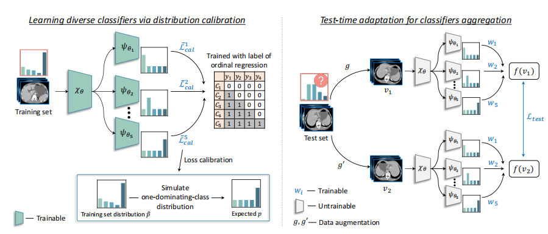

---

### `SADE` [Zhang et al., **NeurIPS 2022**]  
**Self-supervised aggregation of diverse experts for test-agnostic long-tailed recognition**  
[📄 PDF](https://openreview.net/forum?id=m7CmxlpHTiu) · [🔍 G-Scholar](https://scholar.google.com/scholar?cluster=16295847624184830192&hl=en) · [💻 CODE](https://github.com/vanint/sade-agnosticlt)

📌 Abstract · Contributions · Method Overview

#### 🧠 Abstract
Existing long-tailed recognition methods, aiming to train class-balanced models from long-tailed data, generally assume the models would be evaluated on the uniform test class distribution. However, practical test class distributions often violate this assumption (e.g., being either long-tailed or even inversely long-tailed), which may lead existing methods to fail in real applications. In this paper, we study a more practical yet challenging task, called test-agnostic long-tailed recognition, where the training class distribution is long-tailed while the test class distribution is agnostic and not necessarily uniform. In addition to the issue of class imbalance, this task poses another challenge: the class distribution shift between the training and test data is unknown. To tackle this task, we propose a novel approach, called Self-supervised Aggregation of Diverse Experts, which consists of two strategies: (i) a new skill-diverse expert learning strategy that trains multiple experts from a single and stationary long-tailed dataset to separately handle different class distributions; (ii) a novel test-time expert aggregation strategy that leverages self-supervision to aggregate the learned multiple experts for handling unknown test class distributions. We theoretically show that our self-supervised strategy has a provable ability to simulate test-agnostic class distributions. Promising empirical results demonstrate the effectiveness of our method on both vanilla and test-agnostic long-tailed recognition. The source code is available at https://github.com/Vanint/SADE-AgnosticLT.

#### 🖼️ Method Overview

  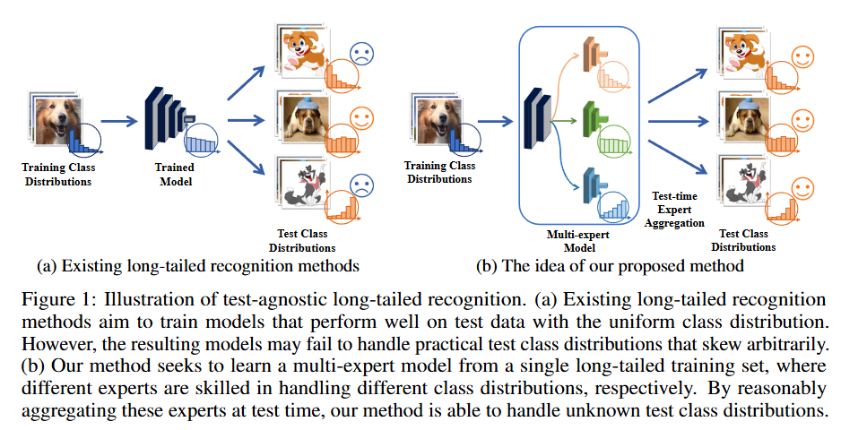

---
### `ProSFDA` [Hu et al., **arXiv 2022**]  
**ProSFDA: Prompt Learning based Source-free Domain Adaptation for Medical  Image Segmentation**  
[📄 PDF](https://arxiv.org/abs/2211.11514) · [💻 CODE](https://github.com/ShishuaiHu/ProSFDA)

📌 Abstract · Method Overview

#### 🧠 Abstract

The domain discrepancy existed between medical images acquired in different situations renders a major hurdle in deploying pre-trained medical image segmentation models for clinical use. Since it is less possible to distribute training data with the pre-trained model due to the huge data size and privacy concern, source-free unsupervised domain adaptation (SFDA) has recently been increasingly studied based on either pseudo labels or prior knowledge. However, the image features and probability maps used by pseudo label-based SFDA and the consistent prior assumption and the prior prediction network used by prior-guided SFDA may become less reliable when the domain discrepancy is large. In this paper, we propose a Prompt learning based SFDA (ProSFDA) method for medical image segmentation, which aims to improve the quality of domain adaption by minimizing explicitly the domain discrepancy. Specifically, in the prompt learning stage, we estimate source-domain images via adding a domain-aware prompt to target-domain images, then optimize the prompt via minimizing the statistic alignment loss, and thereby prompt the source model to generate reliable predictions on (altered) target-domain images. In the feature alignment stage, we also align the features of target-domain images and their styles-augmented counterparts to optimize the source model, and hence push the model to extract compact features. We evaluate our ProSFDA on two multi-domain medical image segmentation benchmarks. Our results indicate that the proposed ProSFDA outperforms substantially other SFDA methods and is even comparable to UDA methods. Code will be available at https://github.com/ShishuaiHu/ProSFDA.

#### 🎯 Contributions

(i) We highlight the domain discrepancy issue existed under the SFDA setting and introduce PLS to address it from the perspective of estimating a domain-aware visual prompt via minimizing the statistic alignment loss. 
(ii)  We develop FAS to force the model to extract compact features from altered target-domain images and diminish the impact of instance variations.. 
(iii) Our ProSFDA achieves superior performance against other SFDA methods on two multi-domain medical image segmentation benchmarks

#### 🖼️ Method Overview

  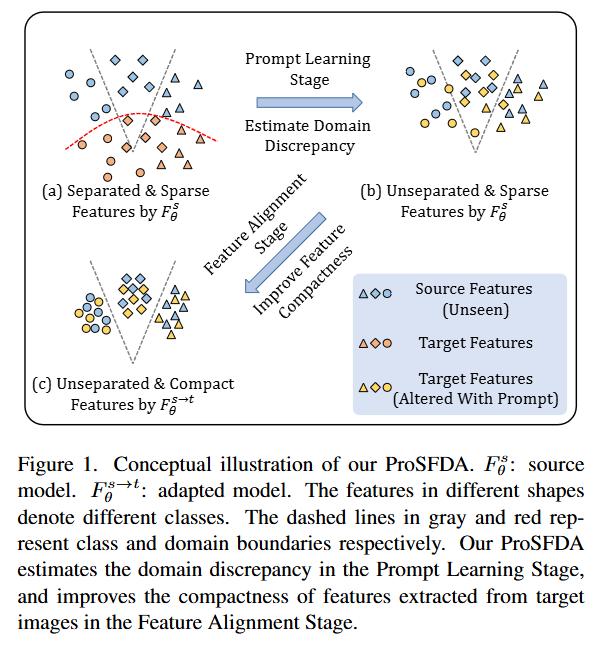  
  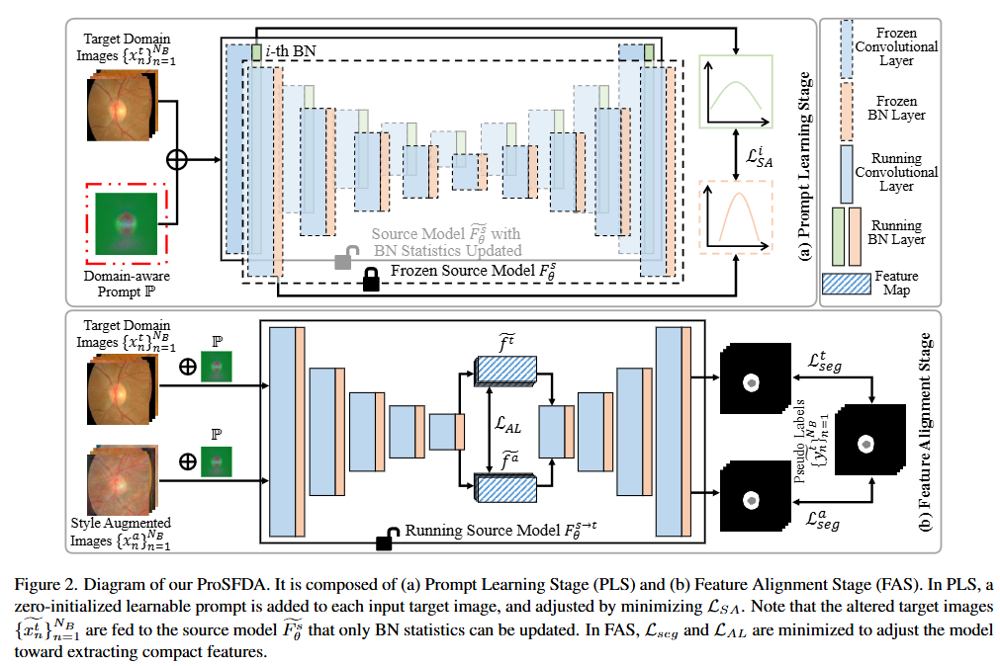

---

### `TTLSA` [Sun et al., **NeurIPS 2023**]  
**Beyond invariance: Test-time label-shift adaptation for distributions with “spurious” correlations**  
[📄 PDF](https://arxiv.org/abs/2211.15646) · [🔍 G-Scholar](https://scholar.google.com/scholar?cluster=8297779371205142813&hl=en) · [💻 CODE](https://github.com/nalzok/test-time-label-shift)

📌 Abstract · Contributions · Datasets & Methods

#### 🧠 Abstract
Changes in the data distribution at test time can have deleterious effects on the performance of predictive models p(y|x). We consider situations where there are additional meta-data labels (such as group labels), denoted by z, that can account for such changes in the distribution.

In particular, we assume that the prior distribution p(y, z), which models the dependence between the class label y and the “nuisance” factors z, may change across domains, either due to a change in the correlation between these terms, or a change in one of their marginals. However, we assume that the generative model for features p(x|y, z) is invariant across domains. We note that this corresponds to an expanded version of the widely used “label shift” assumption, where the labels now also include the nuisance factors z.

Based on this observation, we propose a test-time label shift correction that adapts to changes in the joint distribution p(y, z) using EM applied to unlabeled samples from the target domain distribution, pt(x). Importantly, we are able to avoid fitting a generative model p(x|y, z), and merely need to reweight the outputs of a discriminative model ps(y, z|x) trained on the source distribution.

We evaluate our method, which we call <strong>“Test-Time Label-Shift Adaptation” (TTLSA)</strong>, on several standard image and text datasets, as well as the CheXpert chest X-ray dataset, and show that it improves performance over methods that target invariance to changes in the distribution, as well as baseline empirical risk minimization methods.

🔗 <strong>Code</strong>: <a href="https://github.com/nalzok/test-time-label-shift" target="_blank">https://github.com/nalzok/test-time-label-shift</a>

#### 🎯 Contributions
"Motivated by the above, in this paper we propose a test-time approach for optimally adapting to distribution shifts which arise due to changes in the underlying joint prior between the class labels y and the nuisance labels z. We can view these changes as due to a hidden common cause u, such as the location of a specific hospital. Thus we assume ps(u)̸ = pt(u), where ps is the source distribution, and pt is the target distribution. Consequently, pi(y, z) = ∑ u p(y, z|u)pi(u) will change across domains i. However, we assume that the generative model of the features is invariant across domains, so pi(x | y, z) = p(x | y, z). See Figure 1 for an illustration of our modeling assumptions. The key observation behind our method is that our assumptions are equivalent to the standard 'label shift assumption', except it is defined with respect to an expanded label m = (y, z), which we call the meta-label. We call this the 'expanded label shift assumption'. This lets use existing label shift techniques, such as Alexandari et al. [2020], Lipton et al. [2018], Garg et al. [2020], to adapt our model using a small sample of unlabeled data {xn ∼ pt(x)} from the target domain to adjust for the shift in the prior over meta-labels, as we discuss in Section 3.2. Importantly, although our approach relies on the assumption that p(x | y, z) is preserved across distribution shifts, it is based on learning a discriminative base model ps(y, z, | x), which we adjust to the target distribution pt(y | x), as we explain in Section 3.1. Thus we do not need to fit a generative model to the data. We do need access to labeled examples of the confounding factor z at training time, but such data is often collected anyway (albeit in limited quantities) especially for protected attributes. Additionally, because it operates at test-time, our method does not require retraining to adapt the base model to multiple target domains. We therefore call our approach Test-Time Label Shift Adaptation (TTLSA)"

#### 📂 Datasets

The CheXpert dataset contains 224,316 chest X-rays from 65,240 patients, annotated with 14 disease labels and three attributes (age, sex, race). Labels and attributes are binarized: diseases are classified as "negative" (0) or "positive" (1), age is split by median (0 for below, 1 above), and sex is encoded as female (0) or male (1). Uncertain labels are excluded. The dataset is commonly used to predict Pleural Effusion (class label *y*), with sex as the confounding variable (*z*). Input features (*x*) include either raw 224×224 grayscale images or 1376-dimensional embeddings from a pretrained CXR model (trained on separate U.S. and Indian X-ray data). This setup enables studies on disease prediction while addressing potential biases from demographic confounders.

 

#### 🖼️ Method Overview

  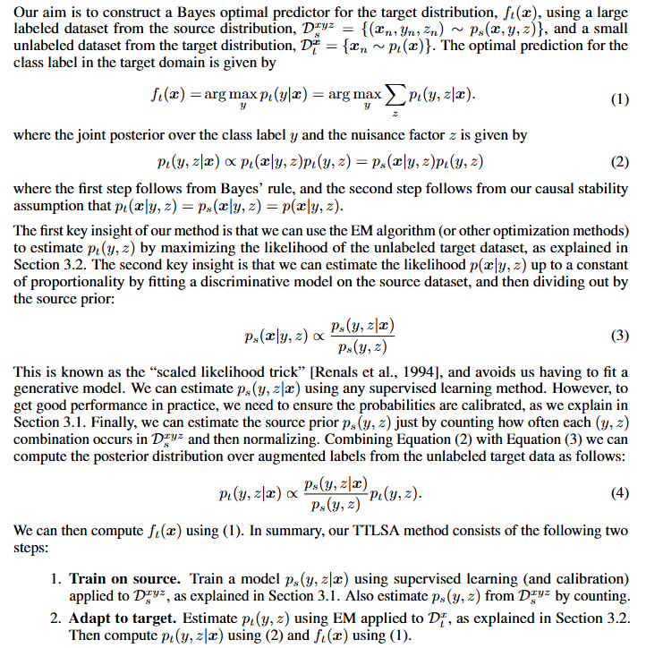

---

### `FedCal` [Xu & Huang, **CIKM 2023**]  
**A joint training-calibration framework for test-time personalization with label shift in federated learning**  
[📄 PDF](https://dl.acm.org/doi/abs/10.1145/3583780.3615173) 

📌 Abstract · Contributions · Method Overview

#### 🧠 Abstract

In domain adaptation, covariate shift and label shift problems are two distinct and complementary tasks. In covariate shift adaptation where the differences in data distribution arise from variations in feature probabilities, existing approaches naturally address this problem based on feature probability matching (FPM). However, for label shift adaptation where the differences in data distribution stem solely from variations in class probability, current methods still use FPM on the d-dimensional feature space to estimate the class probability ratio on the one-dimensional label space.
To address label shift adaptation more naturally and effectively, inspired by a new representation of the source domain’s class probability, we propose a new framework called class probability matching (CPM) which matches two class probability functions on the one-dimensional label space to estimate the class probability ratio, fundamentally different from FPM operating on the d-dimensional feature space. Furthermore, by incorporating the kernel logistic regression into the CPM framework to estimate the conditional probability, we propose an algorithm called class probability matching using kernel methods (CPMKM) for label shift adaptation.
From the theoretical perspective, we establish the optimal convergence rates of CPMKM with respect to the cross-entropy loss for multi-class label shift adaptation. From the experimental perspective, comparisons on real datasets demonstrate that CPMKM outperforms existing FPM-based and maximum-likelihood-based algorithms.

#### 🎯 Contributions

(i) Starting from a representation of the class probability p(y), we construct the new matching framework CPM for estimating the class probability ratio q(y)/p(y), which avoids potential issues associated with FPM methods. More specifically, we use the law of total probability and the feature probability ratio p(x)/q(x) to derive a new representation of p(y) that leads to CPM, which directly matches distributions in the label space rather than in the feature space.   
(ii) We incorporate kernel logistic regression (KLR) into the CPM framework and propose the CPMKM algorithm. Theoretically, we provide optimal convergence rates for CPMKM w.r.t. the cross-entropy loss, including a new oracle inequality for truncated KLR to handle the unboundedness of CE loss. 
(iii) Through experiments on real datasets under various label shift scenarios, CPMKM outperforms FPM-based and EM-based methods in both class probability estimation and target classification. Notably, performance improves as the target sample size increases and stabilizes thereafter, validating the theoretical convergence.

 

#### 🖼️ Method Overview

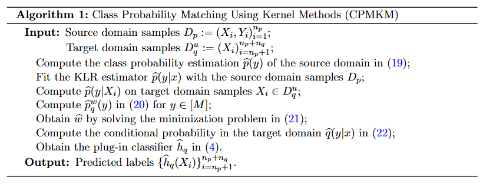

---

### `...` [Park et al., **ICCV 2023**]  
**Label shift adapter for test-time adaptation under covariate and label shifts**  
[📄 PDF](https://arxiv.org/abs/2308.08810) · [🔍 G-Scholar](https://scholar.google.com/scholar?cluster=6476921383522013928&hl=en)

📌 Abstract · Contributions · Method Overview

#### 🧠 Abstract

Test-time adaptation (TTA) aims to adapt a pre-trained model to the target domain in a batch-by-batch manner during inference. While label distributions often exhibit imbalances in real-world scenarios, most previous TTA approaches typically assume that both source and target domain datasets have balanced label distribution. Due to the fact that certain classes appear more frequently in certain domains (e.g., buildings in cities, trees in forests), it is natural that the label distribution shifts as the domain changes. However, we discover that the majority of existing TTA methods fail to address the coexistence of covariate and label shifts. To tackle this challenge, we propose a novel label shift adapter that can be incorporated into existing TTA approaches to deal with label shifts during the TTA process effectively. Specifically, we estimate the label distribution of the target domain to feed it into the label shift adapter. Subsequently, the label shift adapter produces optimal parameters for target label distribution. By predicting only the parameters for a part of the pre-trained source model, our approach is computationally efficient and can be easily applied, regardless of the model architectures. Through extensive experiments, we demonstrate that integrating our strategy with TTA approaches leads to substantial performance improvements under the joint presence of label and covariate shifts.

#### 🎯 Contributions

• We introduce a novel label shift adapter that produces the optimal parameters according to the label distribution. By utilizing the label shift adapter, we can develop a robust TTA algorithm that can handle both covariate and label shifts simultaneously. 
• Our approach is easily applicable to any model regardless of the model architecture and pre-training process. It can be simply integrated with other TTA algorithms. 
• Through extensive experiments on six benchmarks, we demonstrate that our method enhances the performance significantly when source and target domain datasets have class-imbalanced label distributions.

#### 🖼️ Method Overview

    
  

---

### `DROPS` [Wei et al., **ICLR 2023**]  
**Distributionally robust post-hoc classifiers under prior shifts**  
[📄 PDF](https://arxiv.org/abs/2309.08825) · [🔍 G-Scholar](https://scholar.google.com/scholar?cluster=10995720941474911018&hl=en) · [💻 CODE](https://github.com/weijiaheng/Drops)

📌 Abstract · Contributions · Method Overview

#### 🧠 Abstract

The generalization ability of machine learning models degrades significantly when the test distribution shifts away from the training distribution. We investigate the problem of training models that are robust to shifts caused by changes in the distribution of class-priors or group-priors. The presence of skewed training priors can often lead to the models overfitting to spurious features. Unlike existing methods, which optimize for either the worst or the average performance over classes or groups, our work is motivated by the need for finer control over the robustness properties of the model. We present an extremely lightweight post-hoc approach that performs scaling adjustments to predictions from a pre-trained model, with the goal of minimizing a distributionally robust loss around a chosen target distribution. These adjustments are computed by solving a constrained optimization problem on a validation set and applied to the model during test time. Our constrained optimization objective is inspired from a natural notion of robustness to controlled distribution shifts. Our method comes with provable guarantees and empirically makes a strong case for distributional robust post-hoc classifiers. 

🔗 <strong>Code</strong>: <a href="https://github.com/weijiaheng/Drops" target="_blank">https://github.com/weijiaheng/Drops</a>.

---

### `LSC` [Wei et al., **ICML 2024**]  
**Learning label shift correction for test-agnostic long-tailed recognition**  
[📄 PDF](https://openreview.net/forum?id=J3xYTh6xtL) · [🔍 G-Scholar](https://scholar.google.com/scholar?cluster=13080086498775196290&hl=en) · [💻 CODE](https://github.com/Stomach-ache/label-shift-correction)

📌 Abstract · Contributions · Method Overview

#### 🧠 Abstract

Long-tail learning primarily focuses on mitigating the label distribution shift between long-tailed training data and uniformly distributed test data. However, in real-world applications, we often encounter a more intricate challenge where the test label distribution is agnostic. To address this problem, we first theoretically establish the substantial potential for reducing the generalization error if we can precisely estimate the test label distribution. Motivated by the theoretical insight, we introduce a simple yet effective solution called label shift correction (LSC). LSC estimates the test label distribution within the proposed framework of generalized black box shift estimation, and adjusts the predictions from a pre-trained model to align with the test distribution. Theoretical analyses confirm that accurate estimation of test label distribution can effectively reduce the generalization error. Extensive experimental results demonstrate that our method significantly outperforms previous state-of-the-art approaches, especially when confronted with non-uniform test label distribution. Notably, the proposed method is general and complements existing long-tail learning approaches, consistently improving their performance. The source code is available at <a href="https://github.com/Stomach-ache/label-shift-correction" target="_blank">https://github.com/Stomach-ache/label-shift-correction</a>.

#### 🎯 Contributions

1) We introduce a straightforward yet effective method, LSC, to address test-agnostic long-tail learning, capable of accurately estimating test label distributions. 
2) We establish the theoretical foundation to demonstrate the capability of our method to provide more precise test label distribution estimations and reduce generalization error. 
3) We confirm the efficacy of the proposed method on three benchmark datasets. 
4) Importantly, LSC is compatible with existing long-tail learning methods, consistently improving their performance in test-agnostic scenarios.

---
### `SFDA` [Yu et al., **MICCAI 2023**]  
**Source free domain adaptation for medical image segmentation with fourier style mining**  
[📄 PDF](https://arxiv.org/abs/2307.09769) · [💻 CODE]( https://github.com/CSCYQJ/MICCAI23-ProtoContra-SFDA)

📌 Abstract · Method Overview

#### 🧠 Abstract

Unsupervised domain adaptation (UDA) has increasingly gained interest for its capacity to transfer the knowledge learned from a labeled source domain to an unlabeled target domain. However, typical UDA methods require concurrent access to both the source and target domain data, which largely limits its application in medical scenarios where source data is often unavailable due to privacy concern. To tackle the source data-absent problem, we present a novel two-stage source-free domain adaptation (SFDA) framework for medical image segmentation, where only a well-trained source segmentation model and unlabeled target data are available during domain adaptation. Specifically, in the prototype-anchored feature alignment stage, we first utilize the weights of the pre-trained pixel-wise classifier as source prototypes, which preserve the information of source features. Then, we introduce the bi-directional transport to align the target features with class prototypes by minimizing its expected cost. On top of that, a contrastive learning stage is further devised to utilize those pixels with unreliable predictions for a more compact target feature distribution. Extensive experiments on a cross-modality medical segmentation task demonstrate the superiority of our method in large domain discrepancy settings compared with the state-of-the-art SFDA approaches and even some UDA methods. Code is available at: https://github.com/CSCYQJ/MICCAI23-ProtoContra-SFDA.

#### 🎯 Contributions

In this work, we propose a novel SFDA framework for cross-modality medical image segmentation. Our framework contains two sequentially conducted stages, i.e., Prototype-anchored Feature Alignment (PFA) stage and Contrastive Learning (CL) stage. As previous works [12] noted, the weights of the pre-trained classifier (i.e., projection head) can be employed as the source prototypes during domain adaptation. That means we can characterize the features of each class with a source prototype and align the target features with them instead of the inaccessible source features. To that end, during the PFA stage, we first provide a target-to-prototype transport to ensure the target features get close to the corresponding prototypes. Then, considering the trivial solution that all target features are assigned to the dominant class prototype (e.g., background), we add a reverse prototype-to-target transport to encourage diversity. However, although most target features have been assigned to the correct class prototype after PFA, some hard samples with high prediction uncertainty still exist in the decision boundary (see Fig. 1(a→b)). Moreover, we observe that those unreliable predictions usually get confused among only a few classes instead of all classes [18]. Taking the unreliable pixel in Fig. 1(b,c) for example, though it achieves similar high probabilities on the spleen and left kidney, the model is pretty sure about this pixel not belonging to the liver and right kidney. Inspired by this, we use confusing pixels as the negative samples for those unlikely classes, and then introduce the CL stage to pursue a more compact target feature distribution. Finally, we conduct experiments on a cross-modality abdominal multi-organ segmentation task. With only a source model and unlabeled target data, our method outperforms the state-of-the-art SFDA and even achieves comparable results with some classical UDA approaches.

#### 🖼️ Method Overview

  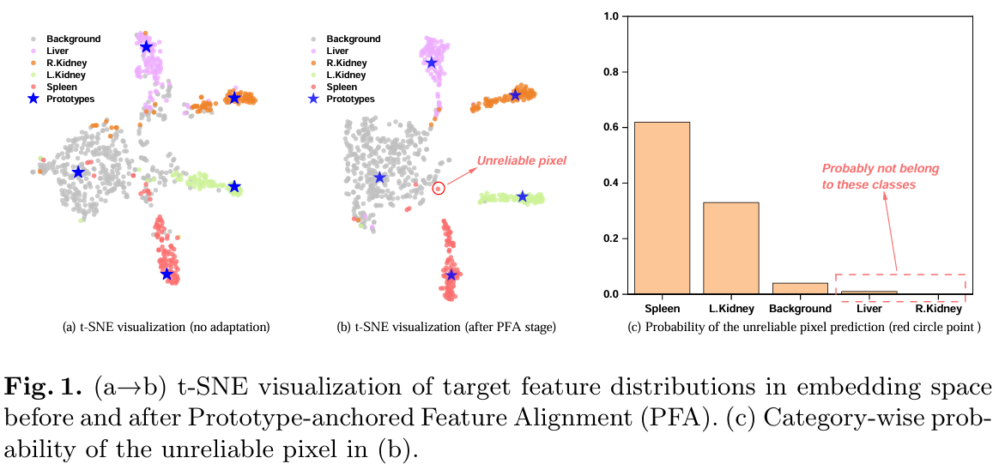  
  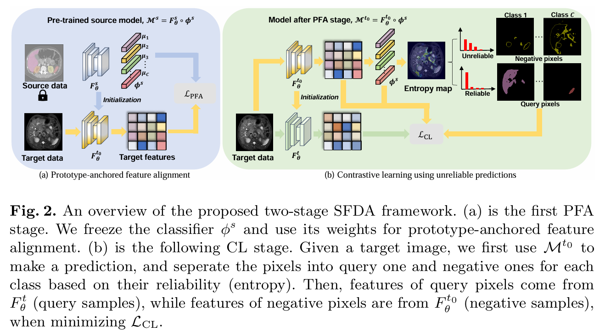

---

### `Wav-O/R` [Qian et al., **ICML 2024**]  
**Efficient non-stationary online learning by wavelets with applications to online distribution shift adaptation**  
[📄 PDF](https://openreview.net/forum?id=KNedb3bQ4h) 

📌 Abstract · Contributions · Method Overview

#### 🧠 Abstract

Dynamic regret minimization offers a principled way for non-stationary online learning, where the algorithm’s performance is evaluated against changing comparators. Prevailing methods often employ a two-layer online ensemble, consisting of a group of base learners with different configurations and a meta learner that combines their outputs. Given the evident computational overhead associated with two-layer algorithms, this paper investigates how to attain optimal dynamic regret without deploying a model ensemble. To this end, we introduce the notion of underlying dynamic regret, a specific form of the general dynamic regret that can encompass many applications of interest. We show that almost optimal dynamic regret can be obtained using a single-layer model alone. This is achieved by an adaptive restart equipped with wavelet detection, wherein a novel streaming wavelet operator is introduced to online update the wavelet coefficients via a carefully designed binary indexed tree. We apply our method to the online label shift adaptation problem, leading to new algorithms with optimal dynamic regret and significantly improved computation/storage efficiency compared to prior arts. Extensive experiments validate our proposal.

#### 🖼️ Method Overview

  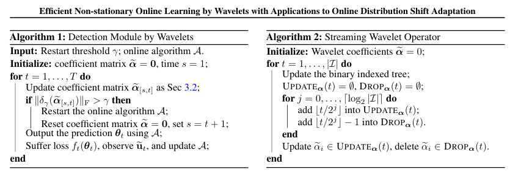  
  

---

### `CPMCN` [Wen et al., **ICLR 2024**]  
**Class probability matching with calibrated networks for label shift adaption**  
[📄 PDF](https://openreview.net/forum?id=mliQ2huFrZ)

📌 Abstract · Contributions · Method Overview

#### 🧠 Abstract

We consider the domain adaptation problem in the context of label shift, where the label distributions between source and target domain differ, but the conditional distributions of features given the label are the same. To solve the label shift adaptation problem, we develop a novel matching framework named class probability matching (CPM). It is inspired by a new understanding of the source domain’s class probability, as well as a specific relationship between class probability ratios and feature probability ratios between the source and target domains. CPM is able to maintain the same theoretical guarantees as the existing feature probability matching framework, while significantly improving the computational efficiency due to directly matching the probabilities of the label variable. Within the CPM framework, we propose an algorithm named class probability matching with calibrated networks (CPMCN) for target domain classification. From the theoretical perspective, we establish a generalization bound of the CPMCN method in order to explain the benefits of introducing calibrated networks. From the experimental perspective, real data comparisons show that CPMCN outperforms existing matching-based and EM-based algorithms.

#### 🎯 Contributions

(i) To solve the label shift adaptation problem, we develop a novel matching framework named class probability matching that directly matches on the probabilities of label Y. Based on this framework we propose a new algorithm called CPMCN for label shift adaptation, which applies the calibrated neural network. CPMCN has low computational complexity and high theoretical guarantees. 
(ii) Theoretically, we provide rigorous theoretical guarantees for our proposed matching framework. Moreover, we establish a generalization bound for the CPMCN algorithm, which illustrates the benefit of incorporating a calibrated network in the algorithm. 
(iii) Experimentally, we validate that CPMCN outperforms existing matching methods and EM-based methods, in class probability ratio estimation and target domain classification.

#### 🖼️ Method Overview

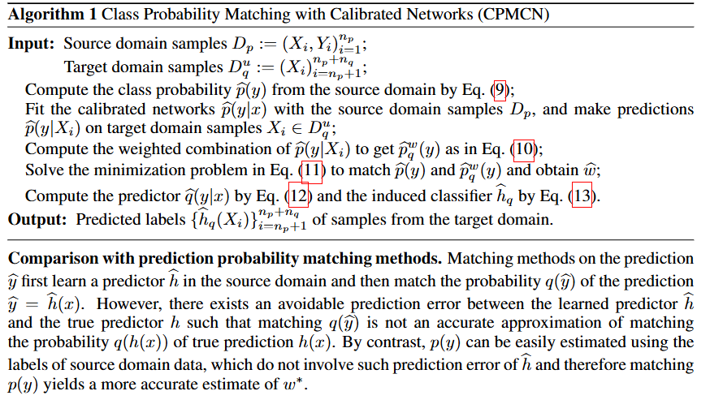

---

### `OLS-OFU` [Wu et al., **arXiv 2024**]  
**Online feature updates improve online (generalized) label shift adaptation**  
[📄 PDF](https://arxiv.org/abs/2402.03545) · [🔍 G-Scholar](https://scholar.google.com/scholar?cluster=13826390929957704274&hl=en)

📌 Abstract · Method Overview

#### 🧠 Abstract

This paper addresses the prevalent issue of label shift in an online setting with missing labels, where data distributions change over time and obtaining timely labels is challenging. While existing methods primarily focus on adjusting or updating the final layer of a pre-trained classifier, we explore the untapped potential of enhancing feature representations using unlabeled data at test-time. Our novel method, Online Label Shift adaptation with Online Feature Updates (OLS-OFU), leverages self-supervised learning to refine the feature extraction process, thereby improving the prediction model. By carefully designing the algorithm, theoretically OLS-OFU maintains the similar online regret convergence to the results in the literature while taking the improved features into account. Empirically, it achieves substantial improvements over existing methods, which is as significant as the gains existing methods have over the baseline (i.e., without distribution shift adaptations).

#### 🖼️ Method Overview

  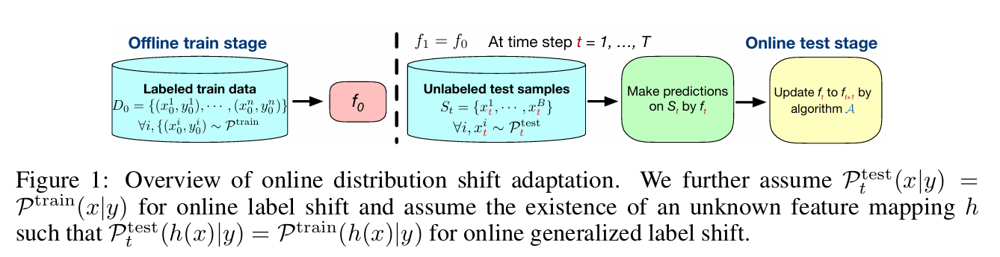  
  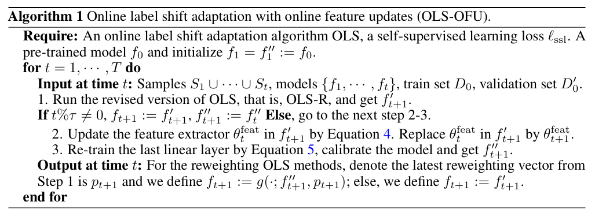

## Segmentation
---
### `DCAC` [Hu et al., **IEEE TMI 2022**]  
Domain and content adaptive convolution based multi-source domain generalization in medical image segmentation 
[📄 PDF](https://arxiv.org/abs/2109.05676) | [🔎 Google Scholar](https://scholar.google.com/scholar?cluster=7895018487155935722&hl=en) | [💻 Code](https://github.com/ShishuaiHu/DCAC/)

---

### `InstCal` [Zou et al., **Proc. ECCV 2022**]  
**Learning instance-specific adaptation for cross-domain segmentation**  
[📄 PDF](https://link.springer.com/chapter/10.1007/978-3-031-19827-4_27) | [🔎 Google Scholar](https://scholar.google.com/scholar?cluster=3479758947644774894&hl=en) | [💻 Code](https://github.com/Yuliang-Zou/InstCal-Pano)

---

### `TASD` [Liu et al., **Proc. AAAI 2022**]  
**Single-domain generalization in medical image segmentation via test-time adaptation from shape dictionary**  
[📄 PDF](https://arxiv.org/abs/2206.14467) | [🔎 Google Scholar](https://scholar.google.com/scholar?cluster=5193566977778450536&hl=en)

---

### `MALL` [Reddy et al., **Proc. ECCV 2022**]  
**Master of all: Simultaneous generalization of urban-scene segmentation to all adverse weather conditions**  
[📄 PDF](https://www.ecva.net/papers/eccv_2022/papers_ECCV/papers/136990051.pdf) | [🔎 Google Scholar](https://scholar.google.com/scholar?cluster=16396707704713565964&hl=en)

---

### `SR-TTT` [Lyu et al., **IEEE TMI 2022**]  
**Learning from synthetic CT images via test-time training for liver tumor segmentation**  
[📄 PDF](https://ieeexplore.ieee.org/abstract/document/9754550/) | [🔎 Google Scholar](https://scholar.google.com/scholar?cluster=13052647575651297623&hl=en) | [💻 Code](https://github.com/FeiLyu/SR-TTT)

---

### `Slot-TTA` [Prabhudesai et al., **Proc. ICML 2023**]  
**Test-time adaptation with slot-centric models**  
[📄 PDF](https://openreview.net/forum?id=b8F8xz6_DuX) | [🔎 Google Scholar](https://scholar.google.com/scholar?cluster=14308566097544119245&hl=en) | [💻 Code](https://github.com/mihirp1998/Slot-TTA)

---

### `DIGA` [Wang et al., **Proc. CVPR 2023**]  
**Dynamically instance-guided adaptation: A backward-free approach for test-time domain adaptive semantic segmentation**  
[📄 PDF](https://openaccess.thecvf.com/content/CVPR2023/html/Wang_Dynamically_Instance-Guided_Adaptation_A_Backward-Free_Approach_for_Test-Time_Domain_Adaptive_CVPR_2023_paper.html) | [🔎 Google Scholar](https://scholar.google.com/scholar?cluster=5310249894401773826&hl=en) | [💻 Code](https://github.com/Waybaba/DIGA)

---

### `CMA` [Bruggemann et al., **Proc. ICCV 2023**]  
**Contrastive model adaptation for cross-condition robustness in semantic segmentation**  
[📄 PDF](http://openaccess.thecvf.com/content/ICCV2023/html/Bruggemann_Contrastive_Model_Adaptation_for_Cross-Condition_Robustness_in_Semantic_Segmentation_ICCV_2023_paper.html) | [🔎 Google Scholar](https://scholar.google.com/scholar?cluster=11262078686777334014&hl=en) | [💻 Code](https://github.com/brdav/cma)

---

### `RNA` [Dumpala et al., **Proc. ICCV 2023**]  
**Rapid network adaptation: Learning to adapt neural networks using test-time feedback**  
[📄 PDF](https://openaccess.thecvf.com/content/ICCV2023/html/Yeo_Rapid_Network_Adaptation_Learning_to_Adapt_Neural_Networks_Using_Test-Time_ICCV_2023_paper.html) | [🔎 Google Scholar](https://scholar.google.com/scholar?cluster=3949626307376398237&hl=en)

---

### `Decorruptor` [Oh et al., **Proc. ECCV 2024**]  
**Efficient diffusion-driven corruption editor for test-time adaptation**  
[📄 PDF](https://arxiv.org/abs/2403.10911) | [🔎 Google Scholar](https://scholar.google.com/scholar?cluster=10378300351599346301&hl=en) | [💻 Code](https://github.com/oyt9306/Decorruptor)

---

### `GenSAM` [Hu et al., **Proc. AAAI 2024**]  
**Relax image-specific prompt requirement in SAM: A single generic prompt for segmenting camouflaged objects**  
[📄 PDF](https://arxiv.org/abs/2312.07374) | [🔎 Google Scholar](https://scholar.google.com/scholar?cluster=3602234802657076128&hl=en) | [💻 Code](https://github.com/jyLin8100/GenSAM)

---

### `TTT4AS` [Costanzino et al., **Proc. CVPR Workshops 2024**]  
**Test time training for industrial anomaly segmentation**  
[📄 PDF](https://arxiv.org/abs/2404.03743) | [🔎 Google Scholar](https://scholar.google.com/scholar?cluster=13668953966639046509&hl=en)

---

### `SaLIP` [Aleem et al., **Proc. CVPR Workshops 2024**]  
**Test-time adaptation with SaLIP: A cascade of SAM and CLIP for zero-shot medical image segmentation**  
[📄 PDF](https://arxiv.org/abs/2404.06362) | [🔎 Google Scholar](https://scholar.google.com/scholar?cluster=2076060907669377814&hl=en) | [💻 Code](https://github.com/aleemsidra/SaLIP)

---

### `Quest4Clone` [Basak and Yin, **Proc. MICCAI 2024**]  
**Quest for clone: Test-time domain adaptation for medical image segmentation by searching the closest clone in latent space**  
[📄 PDF](https://papers.miccai.org/miccai-2024/paper/0297_paper.pdf) | [🔎 Google Scholar](https://scholar.google.com/scholar?cluster=14583918377987812853&hl=en) | [💻 Code](https://github.com/hritam-98/Quest4Clone)

---

### `Seg-TTO` [Silva et al., **arXiv 2025**]  
**Test-time optimization for domain adaptive open vocabulary segmentation**  
[📄 PDF](https://arxiv.org/abs/2501.04696) | [🔎 Google Scholar](https://scholar.google.com/scholar?cluster=11664277597711483004&hl=en)

---

### `INT` [Hu et al., **arXiv 2025**]  
**INT: Instance-specific negative mining for task-generic promptable segmentation**  
[📄 PDF](https://arxiv.org/abs/2501.18753) | [🔎 Google Scholar](https://scholar.google.com/scholar?cluster=18003844780246240761&hl=en)

---
